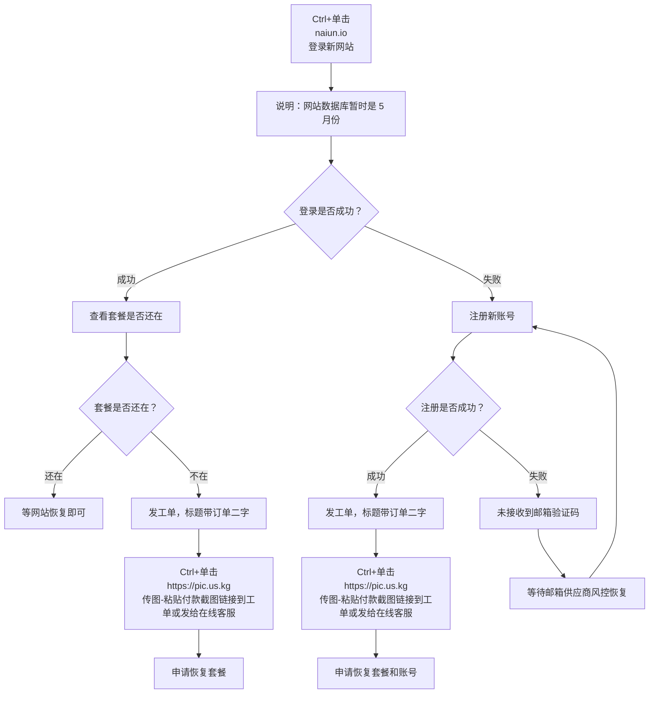

🇨🇳 中文 | 🇺🇸 [English](README_EN.md) | 🇷🇺 
[Русский](README_RU.md) | 🇮🇷 [فارسی](README_FA.md)

# naiyun奈云机场官方地址(2026年7月3日更新)
naiyun奈云机场官网地址</br>
`6.30突发失联，7.1出现转机，进新官网，近期改过密码的用老密码登录`</br>
账号套餐恢复教程：[recovery](https://github.com/jdnei/naiyun#recovery)</br>
最新地址：[naiun.io](https://naiun.io/#/register?code=KacwlzHN)</br>
永久地址：[naiun.io](https://naiun.io/#/register?code=QPB5cCmr)</br>
最新官网地址01：[naiun.org](https://naiun.org/#/register?code=QPB5cCmr)</br>
最新官网地址02：[naiun.io](https://naiun.io/#/register?code=KacwlzHN)</br>

2026最新好用的机场推荐与节点分享：[https://github.com/jdnei/JiChangTuiJian](https://github.com/jdnei/JiChangTuiJian)</br>
## Telegram VPN 机场福利社 #AD
[机场抽奖群](https://331024.de/archives/choujiang)｜[机场聊天群](https://331024.de/archives/choujiang)｜[机场体验群](https://331024.de/archives/choujiang)</br>

[https://331024.de/archives/choujiang](https://331024.de/archives/choujiang)
## 简介
“奈云”是一款专业的网络链路优化服务，支持全球 86 接入点并且配有[美国家宽](https://github.com/jdnei/naiyun#1%E7%BE%8E%E5%9B%BD)，[香港家宽](https://github.com/jdnei/naiyun#2%E9%A6%99%E6%B8%AF)，[台湾家宽](https://github.com/jdnei/naiyun#3%E5%8F%B0%E6%B9%BE)，[日本家宽](https://github.com/jdnei/naiyun#4%E6%97%A5%E6%9C%AC)，[韩国家宽](https://github.com/jdnei/naiyun#5%E9%9F%A9%E5%9B%BD)，马来西亚家宽。旨在为跨境办公、海外学术搜索及影音爱好者提供稳定的网络加速支持。
## 奈云机场邀请码
此邀请码注册，可免费体验3天无限流量的服务。</br>
```bash
QPB5cCmr
```
## 奈云机场折扣码
```bash
NYNY
```
免费期结束后，新户首单年费可用一次折扣码，可~~168元/年~~，XX元/年，优惠购买一年使用时间。  

## 套餐
| 套餐名称          | 价格        | 计费方式   | 每月流量/总流量 | 使用期限     | 支持设备数 | 速度上限      | 专线网络 | 流媒体解锁 | 机房专柜 | 账号分享 | 备注                 |
| --------------- | ----------- | -------- | ------------- | -------- | -------- | ----------- | -------- | -------- | -------- | -------- | -------------------- |
| Basic-基础套餐(特惠) | ¥168.00     | 每年     | 168G          | 每年     | 5台      | 5000M       | 可用     | 支持     | 有       | 不允许   | 订单日自动重置         |
| Pro-进阶套餐      | ¥38.00      | 每月     | 388G          | 每月     | 5台      | 5000M       | 可用     | 支持     | 有       | 不允许   | 订单日自动重置         |
| Max-专业套餐      | ¥58.00      | 每月     | 788G          | 每月     | 5台      | 5000M       | 可用     | 支持     | 有       | 不允许   | 订单日自动重置         |
| 280G [按量计费]   | ¥98.00      | 一次性   | 280G          | 不限时    | 5台      | 5000M       | 可用     | 支持     | 有       | 不允许   | 流量用完为止，多次购买无法叠加 |
| 680G [按量计费]   | ¥258.00     | 一次性   | 680G          | 不限时    | 5台      | 5000M       | 可用     | 支持     | 有       | 不允许   | 流量用完为止，多次购买无法叠加 |

## 优势
全球覆盖： 部署 86 个全球 POP 接入点，涵盖东南亚、欧美及部分稀缺地区。</br>
企业级链路： 采用 Global Accelerator 国际专线技术，全节点 SLA 高可用保障。</br>
超高清支持： 优化了对主流 4K/8K 视频流媒体的传输效率，延迟极低。</br>
## 📊 性能实测与分析  
#### 1.晚高峰测速表现  
  
#### 2.流媒体解锁报告  
    
#### 3.落地入口分析  

#### 4.家宽纯净度分析  
##### 1.美国  
  
##### 2.香港  
  
##### 3.台湾  
  
##### 4.日本  
  
##### 5.韩国  
  
#### 5.服务器状态整理
<details>
<summary><strong>点击展开服务器列表</strong></summary>   
    
| 分组  | 名称                                           | 协议     | 倍率   | 状态  | 负载  |
| --- | -------------------------------------------- | ------ | ---- | --- | --- |
| HK  | 🇭🇰 HKG·香港01 ¹ˣ                             | TROJAN | x1.0 | 在线  | 11% |
| HK  | 🇭🇰 HKG·香港02 ¹ˣ                             | TROJAN | x1.0 | 在线  | 11% |
| HK  | 🇭🇰 HKG·香港03 ¹ˣ                             | TROJAN | x1.0 | 在线  | 11% |
| HK  | 🇭🇰 HKG·香港04 ¹ˣ                             | TROJAN | x1.0 | 在线  | 11% |
| HK  | 🇭🇰 HKG·香港05 ¹ˣ                             | TROJAN | x1.0 | 在线  | 11% |
| HK  | 🇭🇰 HKG·香港01 ³ˣ                             | TROJAN | x3.0 | 在线  | 56% |
| HK  | 🇭🇰 HKG·香港02 ³ˣ                             | TROJAN | x3.0 | 在线  | 56% |
| HK  | 🇭🇰 HKG·香港03 ³ˣ                             | TROJAN | x3.0 | 在线  | 56% |
| HK  | 🇭🇰 HKG·香港05 ³ˣ                             | TROJAN | x3.0 | 在线  | 56% |
| HK  | 🇭🇰 HKG·香港06 ³ˣ                             | TROJAN | x3.0 | 在线  | 56% |
| HK  | 🇭🇰 HKG·香港07 ³ˣ                             | TROJAN | x3.0 | 在线  | 56% |
| HK  | 🇭🇰 HKG·香港08 ³ˣ                             | TROJAN | x3.0 | 在线  | 56% |
| HK  | 🇭🇰 HKG·香港09 ³ˣ                             | TROJAN | x3.0 | 在线  | 56% |
| HK  | 🇭🇰 HKG·香港10 ³ˣ                             | TROJAN | x3.0 | 在线  | 56% |
| HK  | 🇭🇰 HKG·香港ISP-家宽 ³ˣ                         | TROJAN | x3.0 | 在线  | 56% |
| US  | 🇺🇸 USA·美国01 ¹ˣ                             | TROJAN | x1.0 | 在线  | 11% |
| US  | 🇺🇸 USA·美国02 ¹ˣ                             | TROJAN | x1.0 | 在线  | 11% |
| US  | 🇺🇸 USA·美国03 ¹ˣ                             | TROJAN | x1.0 | 在线  | 11% |
| US  | 🇺🇸 USA·美国04 ¹ˣ                             | TROJAN | x1.0 | 在线  | 11% |
| US  | 🇺🇸 USA·美国05 ¹ˣ                             | TROJAN | x1.0 | 在线  | 11% |
| US  | 🇺🇸 USA·美国01 ³ˣ                             | TROJAN | x3.0 | 在线  | 56% |
| US  | 🇺🇸 USA·美国02 ³ˣ                             | TROJAN | x3.0 | 在线  | 56% |
| US  | 🇺🇸 USA·美国03 ³ˣ                             | TROJAN | x3.0 | 在线  | 56% |
| US  | 🇺🇸 USA·美国05 ³ˣ                             | TROJAN | x3.0 | 在线  | 56% |
| US  | 🇺🇸 USA·美国06 ³ˣ                             | TROJAN | x3.0 | 在线  | 56% |
| US  | 🇺🇸 USA·美国07 ³ˣ                             | TROJAN | x3.0 | 在线  | 56% |
| US  | 🇺🇸 USA·美国08 ³ˣ                             | TROJAN | x3.0 | 在线  | 56% |
| US  | 🇺🇸 USA·美国09 ³ˣ                             | TROJAN | x3.0 | 在线  | 56% |
| US  | 🇺🇸 USA·美国10 ³ˣ                             | TROJAN | x3.0 | 在线  | 56% |
| US  | 🇺🇸 USA·美国ISP-家宽 ³ˣ                         | TROJAN | x3.0 | 在线  | 56% |
| US  | 🇹🇼 TWN·台湾02 ³ˣ                             | TROJAN | x3.0 | 在线  | 56% |
| TW  | 🇹🇼 TWN·台湾01 ¹ˣ                             | TROJAN | x1.0 | 在线  | 11% |
| TW  | 🇹🇼 TWN·台湾02 ¹ˣ                             | TROJAN | x1.0 | 在线  | 11% |
| TW  | 🇹🇼 TWN·台湾01 ³ˣ                             | TROJAN | x3.0 | 在线  | 56% |
| TW  | 🇹🇼 TWN·台湾03 ³ˣ                             | TROJAN | x3.0 | 在线  | 56% |
| TW  | 🇹🇼 TWN·台湾05 ³ˣ                             | TROJAN | x3.0 | 在线  | 56% |
| TW  | 🇹🇼 TWN·台湾06 ³ˣ                             | TROJAN | x3.0 | 在线  | 56% |
| TW  | 🇹🇼 TWN·台湾07 ³ˣ                             | TROJAN | x3.0 | 在线  | 56% |
| TW  | 🇹🇼 TWN·台湾08 ³ˣ                             | TROJAN | x3.0 | 在线  | 56% |
| TW  | 🇹🇼 TWN·台湾ISP-家宽 ³ˣ                         | TROJAN | x3.0 | 在线  | 56% |
| SG  | 🇸🇬 SGP·新加坡01 ¹ˣ                            | TROJAN | x1.0 | 在线  | 11% |
| SG  | 🇸🇬 SGP·新加坡02 ¹ˣ                            | TROJAN | x1.0 | 在线  | 11% |
| SG  | 🇸🇬 SGP·新加坡01 ³ˣ                            | TROJAN | x3.0 | 在线  | 56% |
| SG  | 🇸🇬 SGP·新加坡02 ³ˣ                            | TROJAN | x3.0 | 在线  | 56% |
| SG  | 🇸🇬 SGP·新加坡03 ³ˣ                            | TROJAN | x3.0 | 在线  | 56% |
| SG  | 🇸🇬 SGP·新加坡05 ³ˣ                            | TROJAN | x3.0 | 在线  | 56% |
| SG  | 🇸🇬 SGP·新加坡06 ³ˣ                            | TROJAN | x3.0 | 在线  | 56% |
| JP  | 🇯🇵 JPN·日本01 ¹ˣ                             | TROJAN | x1.0 | 在线  | 11% |
| JP  | 🇯🇵 JPN·日本02 ¹ˣ                             | TROJAN | x1.0 | 在线  | 11% |
| JP  | 🇯🇵 JPN·日本01 ³ˣ                             | TROJAN | x3.0 | 在线  | 56% |
| JP  | 🇯🇵 JPN·日本02 ³ˣ                             | TROJAN | x3.0 | 在线  | 56% |
| JP  | 🇯🇵 JPN·日本03 ³ˣ                             | TROJAN | x3.0 | 在线  | 56% |
| JP  | 🇯🇵 JPN·日本05 ³ˣ                             | TROJAN | x3.0 | 在线  | 56% |
| JP  | 🇯🇵 JPN·日本06 ³ˣ                             | TROJAN | x3.0 | 在线  | 56% |
| JP  | 🇯🇵 JPN·日本ISP-家宽 ³ˣ                         | TROJAN | x3.0 | 在线  | 56% |
| KR  | 🇰🇷 KOR·韩国01 ¹ˣ                             | TROJAN | x1.0 | 在线  | 11% |
| KR  | 🇰🇷 KOR·韩国02 ¹ˣ                             | TROJAN | x1.0 | 在线  | 11% |
| KR  | 🇰🇷 KOR·韩国01 ³ˣ                             | TROJAN | x3.0 | 在线  | 56% |
| KR  | 🇰🇷 KOR·韩国02 ³ˣ                             | TROJAN | x3.0 | 在线  | 56% |
| KR  | 🇰🇷 KOR·韩国03 ³ˣ                             | TROJAN | x3.0 | 在线  | 56% |
| KR  | 🇰🇷 KOR·韩国05 ³ˣ                             | TROJAN | x3.0 | 在线  | 56% |
| KR  | 🇰🇷 KOR·韩国06 ³ˣ                             | TROJAN | x3.0 | 在线  | 56% |
| KR  | 🇰🇷 KOR·韩国ISP-家宽 ³ˣ                         | TROJAN | x3.0 | 在线  | 56% |
| TH  | 🇹🇭 THA·泰国01 ³ˣ                             | TROJAN | x3.0 | 在线  | 56% |
| TH  | 🇹🇭 THA·泰国02 ³ˣ                             | TROJAN | x3.0 | 在线  | 56% |
| TH  | 🇹🇭 THA·泰国03 ³ˣ                             | TROJAN | x3.0 | 在线  | 56% |
| MY  | 🇲🇾 MYS·马来西亚01 ³ˣ                           | TROJAN | x3.0 | 在线  | 56% |
| MY  | 🇲🇾 MYS·马来西亚ISP-家宽 ³ˣ                       | TROJAN | x3.0 | 在线  | 56% |
| VN  | 🇻🇳 VNM·越南01 ³ˣ                             | TROJAN | x3.0 | 在线  | 56% |
| PH  | 🇵🇭 PHL·菲律宾01 ³ˣ                            | TROJAN | x3.0 | 在线  | 56% |
| ID  | 🇮🇩 IDN·印度尼西亚01 ³ˣ                          | TROJAN | x3.0 | 在线  | 56% |
| TR  | 🇹🇷 TUR·土耳其01 ³ˣ                            | TROJAN | x3.0 | 在线  | 56% |
| TR  | 🇹🇷 TUR·土耳其02 ³ˣ                            | TROJAN | x3.0 | 在线  | 56% |
| TR  | 🇹🇷 TUR·土耳其03 ³ˣ                            | TROJAN | x3.0 | 在线  | 56% |
| GB  | 🇬🇧 GBR·英国01 ³ˣ                             | TROJAN | x3.0 | 在线  | 56% |
| GB  | 🇬🇧 GBR·英国02 ³ˣ                             | TROJAN | x3.0 | 在线  | 56% |
| GB  | 🇬🇧 GBR·英国03 ³ˣ                             | TROJAN | x3.0 | 在线  | 56% |
| DE  | 🇩🇪 DEU·德国01 ³ˣ                             | TROJAN | x3.0 | 在线  | 56% |
| FR  | 🇫🇷 FRA·法国01 ³ˣ                             | TROJAN | x3.0 | 在线  | 56% |
| BR  | 🇧🇷 BRA·巴西01 ³ˣ                             | TROJAN | x3.0 | 在线  | 56% |
| AE  | 🇦🇪 ARE·阿联酋01 ³ˣ                            | TROJAN | x3.0 | 在线  | 56% |
| 未分组 | 🇨🇳如遇节点失效，请尝试更新订阅                           | VMESS  | x3.0 | 维护中 | —   |
| 未分组 | 🇨🇳永久地址：[WWW.V2NY.COM](https://github.com/jdnei/naiyun) | VMESS  | x3.0 | 维护中 | —   |
| 未分组 | 🇨🇳大陆访问：v13.v2ny.me                         | VMESS  | x3.0 | 维护中 | —   |
| 未分组 | 🇨🇳[官方]👇Telegram群组👇                       | VMESS  | x3.0 | 维护中 | —   |
| 未分组 | 🇨🇳欢迎加入👉@V2NAIUN👈                         | VMESS  | x3.0 | 维护中 | —   |

</details>

## Recovery
### 账号套餐恢复教程
`流程解释权归奈云官方，可能随时有变化`</br>

