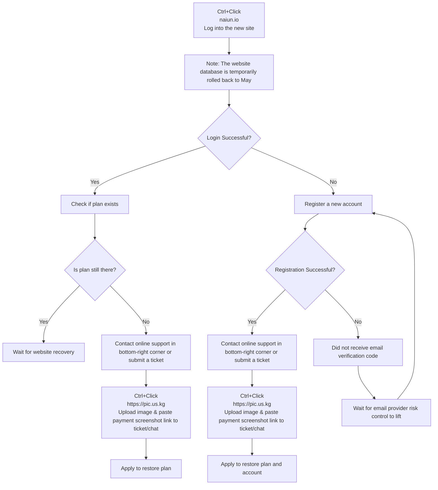

🇨🇳 [中文](README.md) | 🇺🇸 English | 🇷🇺 [Русский](README_RU.md) | 🇮🇷 [فارسی](README_FA.md)

# naiyun Official Address (Updated July 8, 2026)

naiyun Official Website Address</br>
`Sudden connection loss on 6.30, a turning point appeared on 7.1. Enter the ⬇️⬇️ new official website and follow the ⬇️⬇️ process to recover. As of 7.5, the blogger's own annual plan has been restored.`</br>
Account & Plan Recovery Tutorial: [recovery](https://github.com/jdnei/naiyun#recovery)</br>
Latest Address 01: [naiun.io](https://naiun.io/#/register?code=QPB5cCmr)</br>
Latest Address 02: [naiun.org](https://naiun.org/#/register?code=QPB5cCmr)</br>
Official Website Address: [naiun.one](https://naiun.one/#/register?code=QPB5cCmr)</br>
Permanent Address: [naiun.online](https://naiun.online/#/register?code=QPB5cCmr)</br>

2026 Latest Recommended VPNs/Airports & Node Sharing: [https://github.com/jdnei/JiChangTuiJian](https://github.com/jdnei/JiChangTuiJian)

## Telegram VPN Perks Hub #AD

[Airport Raffle Group](https://331024.de/archives/choujiang)｜[Airport Chat Group](https://331024.de/archives/choujiang)｜[Airport Trial Group](https://331024.de/archives/choujiang)

[https://331024.de/archives/choujiang](https://331024.de/archives/choujiang)

## Introduction

"Naiyun" is a professional network link optimization service that supports 86 global access points and features residential IPs in the [US](https://github.com/jdnei/naiyun#1%E7%BE%8E%E5%9B%BD), [Hong Kong](https://github.com/jdnei/naiyun#2%E9%A6%99%E6%B8%AF), [Taiwan](https://github.com/jdnei/naiyun#3%E5%8F%B0%E6%B9%BE), [Japan](https://github.com/jdnei/naiyun#4%E6%97%A5%E6%9C%AC), [South Korea](https://github.com/jdnei/naiyun#5%E9%9F%A9%E5%9B%BD), and Malaysia. It is designed to provide stable network acceleration for cross-border commuting, overseas academic research, and multimedia enthusiasts.

## Naiyun Referral Code

`Use this referral code during registration to get a free 10-day / 50GB plan`

```bash
QPB5cCmr

```

## Naiyun Promo Code

`Valid until July 20, 2026, 23:59`

```bash
RENEW_NAIUN_ONE

```

After the free trial ends, new users can apply this promo code on their first annual order to reduce the price from ~~168 RMB/Year~~ to XX RMB/Year for a one-year subscription.

## Plans

| Plan Name | Price | Billing Cycle | Data Limit | Validity | Max Devices | Speed Limit | Premium IEPL | Streaming Unlock | Dedicated Server | Account Sharing | Remarks |
| --- | --- | --- | --- | --- | --- | --- | --- | --- | --- | --- | --- |
| Basic (Special Offer) | ¥168.00 | Annually | 168G | 1 Year | 5 | 5000M | Available | Supported | Yes | Prohibited | Resets automatically on order date |
| Pro | ¥38.00 | Monthly | 388G | 1 Month | 5 | 5000M | Available | Supported | Yes | Prohibited | Resets automatically on order date |
| Max | ¥58.00 | Monthly | 788G | 1 Month | 5 | 5000M | Available | Supported | Yes | Prohibited | Resets automatically on order date |
| 280G [Pay-As-You-Go] | ¥98.00 | One-time | 280G | No Expire | 5 | 5000M | Available | Supported | Yes | Prohibited | Valid until data runs out; multiple purchases do not stack |
| 680G [Pay-As-You-Go] | ¥258.00 | One-time | 680G | No Expire | 5 | 5000M | Available | Supported | Yes | Prohibited | Valid until data runs out; multiple purchases do not stack |

## Advantages

Global Coverage: Deployed 86 global POP access points, covering Southeast Asia, Europe, America, and rare regions.
Enterprise-grade Links: Utilizes Global Accelerator international dedicated line technology with full-node SLA high-availability assurance.
Ultra-HD Support: Optimized transmission efficiency for mainstream 4K/8K video streaming with extremely low latency.

## 📊 Performance Testing & Analysis

#### 1. Evening Peak Speed Test

#### 2. Streaming Media Unlocking Report

#### 3. Entry and Exit Node Analysis

#### 4. Residential IP Purity Analysis

##### 1. United States

##### 2. Hong Kong

##### 3. Taiwan

##### 4. Japan

##### 5. South Korea

#### 5. Server Status Summary

| Group | Node Name | Protocol | Multiplier | Status | Load |
| --- | --- | --- | --- | --- | --- |
| HK | 🇭🇰 HKG·Hong Kong 01 ¹ˣ | TROJAN | x1.0 | Online | 11% |
| HK | 🇭🇰 HKG·Hong Kong 02 ¹ˣ | TROJAN | x1.0 | Online | 11% |
| HK | 🇭🇰 HKG·Hong Kong 03 ¹ˣ | TROJAN | x1.0 | Online | 11% |
| HK | 🇭🇰 HKG·Hong Kong 04 ¹ˣ | TROJAN | x1.0 | Online | 11% |
| HK | 🇭🇰 HKG·Hong Kong 05 ¹ˣ | TROJAN | x1.0 | Online | 11% |
| HK | 🇭🇰 HKG·Hong Kong 01 ³ˣ | TROJAN | x3.0 | Online | 56% |
| HK | 🇭🇰 HKG·Hong Kong 02 ³ˣ | TROJAN | x3.0 | Online | 56% |
| HK | 🇭🇰 HKG·Hong Kong 03 ³ˣ | TROJAN | x3.0 | Online | 56% |
| HK | 🇭🇰 HKG·Hong Kong 05 ³ˣ | TROJAN | x3.0 | Online | 56% |
| HK | 🇭🇰 HKG·Hong Kong 06 ³ˣ | TROJAN | x3.0 | Online | 56% |
| HK | 🇭🇰 HKG·Hong Kong 07 ³ˣ | TROJAN | x3.0 | Online | 56% |
| HK | 🇭🇰 HKG·Hong Kong 08 ³ˣ | TROJAN | x3.0 | Online | 56% |
| HK | 🇭🇰 HKG·Hong Kong 09 ³ˣ | TROJAN | x3.0 | Online | 56% |
| HK | 🇭🇰 HKG·Hong Kong 10 ³ˣ | TROJAN | x3.0 | Online | 56% |
| HK | 🇭🇰 HKG·Hong Kong ISP-Resi ³ˣ | TROJAN | x3.0 | Online | 56% |
| US | 🇺🇸 USA·United States 01 ¹ˣ | TROJAN | x1.0 | Online | 11% |
| US | 🇺🇸 USA·United States 02 ¹ˣ | TROJAN | x1.0 | Online | 11% |
| US | 🇺🇸 USA·United States 03 ¹ˣ | TROJAN | x1.0 | Online | 11% |
| US | 🇺🇸 USA·United States 04 ¹ˣ | TROJAN | x1.0 | Online | 11% |
| US | 🇺🇸 USA·United States 05 ¹ˣ | TROJAN | x1.0 | Online | 11% |
| US | 🇺🇸 USA·United States 01 ³ˣ | TROJAN | x3.0 | Online | 56% |
| US | 🇺🇸 USA·United States 02 ³ˣ | TROJAN | x3.0 | Online | 56% |
| US | 🇺🇸 USA·United States 03 ³ˣ | TROJAN | x3.0 | Online | 56% |
| US | 🇺🇸 USA·United States 05 ³ˣ | TROJAN | x3.0 | Online | 56% |
| US | 🇺🇸 USA·United States 06 ³ˣ | TROJAN | x3.0 | Online | 56% |
| US | 🇺🇸 USA·United States 07 ³ˣ | TROJAN | x3.0 | Online | 56% |
| US | 🇺🇸 USA·United States 08 ³ˣ | TROJAN | x3.0 | Online | 56% |
| US | 🇺🇸 USA·United States 09 ³ˣ | TROJAN | x3.0 | Online | 56% |
| US | 🇺🇸 USA·United States 10 ³ˣ | TROJAN | x3.0 | Online | 56% |
| US | 🇺🇸 USA·United States ISP-Resi ³ˣ | TROJAN | x3.0 | Online | 56% |
| TW | 🇹🇼 TWN·Taiwan 02 ³ˣ | TROJAN | x3.0 | Online | 56% |
| TW | 🇹🇼 TWN·Taiwan 01 ¹ˣ | TROJAN | x1.0 | Online | 11% |
| TW | 🇹🇼 TWN·Taiwan 02 ¹ˣ | TROJAN | x1.0 | Online | 11% |
| TW | 🇹🇼 TWN·Taiwan 01 ³ˣ | TROJAN | x3.0 | Online | 56% |
| TW | 🇹🇼 TWN·Taiwan 03 ³ˣ | TROJAN | x3.0 | Online | 56% |
| TW | 🇹🇼 TWN·Taiwan 05 ³ˣ | TROJAN | x3.0 | Online | 56% |
| TW | 🇹🇼 TWN·Taiwan 06 ³ˣ | TROJAN | x3.0 | Online | 56% |
| TW | 🇹🇼 TWN·Taiwan 07 ³ˣ | TROJAN | x3.0 | Online | 56% |
| TW | 🇹🇼 TWN·Taiwan 08 ³ˣ | TROJAN | x3.0 | Online | 56% |
| TW | 🇹🇼 TWN·Taiwan ISP-Resi ³ˣ | TROJAN | x3.0 | Online | 56% |
| SG | 🇸🇬 SGP·Singapore 01 ¹ˣ | TROJAN | x1.0 | Online | 11% |
| SG | 🇸🇬 SGP·Singapore 02 ¹ˣ | TROJAN | x1.0 | Online | 11% |
| SG | 🇸🇬 SGP·Singapore 01 ³ˣ | TROJAN | x3.0 | Online | 56% |
| SG | 🇸🇬 SGP·Singapore 02 ³ˣ | TROJAN | x3.0 | Online | 56% |
| SG | 🇸🇬 SGP·Singapore 03 ³ˣ | TROJAN | x3.0 | Online | 56% |
| SG | 🇸🇬 SGP·Singapore 05 ³ˣ | TROJAN | x3.0 | Online | 56% |
| SG | 🇸🇬 SGP·Singapore 06 ³ˣ | TROJAN | x3.0 | Online | 56% |
| JP | 🇯🇵 JPN·Japan 01 ¹ˣ | TROJAN | x1.0 | Online | 11% |
| JP | 🇯🇵 JPN·Japan 02 ¹ˣ | TROJAN | x1.0 | Online | 11% |
| JP | 🇯🇵 JPN·Japan 01 ³ˣ | TROJAN | x3.0 | Online | 56% |
| JP | 🇯🇵 JPN·Japan 02 ³ˣ | TROJAN | x3.0 | Online | 56% |
| JP | 🇯🇵 JPN·Japan 03 ³ˣ | TROJAN | x3.0 | Online | 56% |
| JP | 🇯🇵 JPN·Japan 05 ³ˣ | TROJAN | x3.0 | Online | 56% |
| JP | 🇯🇵 JPN·Japan 06 ³ˣ | TROJAN | x3.0 | Online | 56% |
| JP | 🇯🇵 JPN·Japan ISP-Resi ³ˣ | TROJAN | x3.0 | Online | 56% |
| KR | 🇰🇷 KOR·South Korea 01 ¹ˣ | TROJAN | x1.0 | Online | 11% |
| KR | 🇰🇷 KOR·South Korea 02 ¹ˣ | TROJAN | x1.0 | Online | 11% |
| KR | 🇰🇷 KOR·South Korea 01 ³ˣ | TROJAN | x3.0 | Online | 56% |
| KR | 🇰🇷 KOR·South Korea 02 ³ˣ | TROJAN | x3.0 | Online | 56% |
| KR | 🇰🇷 KOR·South Korea 03 ³ˣ | TROJAN | x3.0 | Online | 56% |
| KR | 🇰🇷 KOR·South Korea 05 ³ˣ | TROJAN | x3.0 | Online | 56% |
| KR | 🇰🇷 KOR·South Korea 06 ³ˣ | TROJAN | x3.0 | Online | 56% |
| KR | 🇰🇷 KOR·South Korea ISP-Resi ³ˣ | TROJAN | x3.0 | Online | 56% |
| TH | 🇹🇭 THA·Thailand 01 ³ˣ | TROJAN | x3.0 | Online | 56% |
| TH | 🇹🇭 THA·Thailand 02 ³ˣ | TROJAN | x3.0 | Online | 56% |
| TH | 🇹🇭 THA·Thailand 03 ³ˣ | TROJAN | x3.0 | Online | 56% |
| MY | 🇲🇾 MYS·Malaysia 01 ³ˣ | TROJAN | x3.0 | Online | 56% |
| MY | 🇲🇾 MYS·Malaysia ISP-Resi ³ˣ | TROJAN | x3.0 | Online | 56% |
| VN | 🇻🇳 VNM·Vietnam 01 ³ˣ | TROJAN | x3.0 | Online | 56% |
| PH | 🇵🇭 PHL·Philippines 01 ³ˣ | TROJAN | x3.0 | Online | 56% |
| ID | 🇮🇩 IDN·Indonesia 01 ³ˣ | TROJAN | x3.0 | Online | 56% |
| TR | 🇹🇷 TUR·Turkey 01 ³ˣ | TROJAN | x3.0 | Online | 56% |
| TR | 🇹🇷 TUR·Turkey 02 ³ˣ | TROJAN | x3.0 | Online | 56% |
| TR | 🇹🇷 TUR·Turkey 03 ³ˣ | TROJAN | x3.0 | Online | 56% |
| GB | 🇬🇧 GBR·United Kingdom 01 ³ˣ | TROJAN | x3.0 | Online | 56% |
| GB | 🇬🇧 GBR·United Kingdom 02 ³ˣ | TROJAN | x3.0 | Online | 56% |
| GB | 🇬🇧 GBR·United Kingdom 03 ³ˣ | TROJAN | x3.0 | Online | 56% |
| DE | 🇩🇪 DEU·Germany 01 ³ˣ | TROJAN | x3.0 | Online | 56% |
| FR | 🇫🇷 FRA·France 01 ³ˣ | TROJAN | x3.0 | Online | 56% |
| BR | 🇧🇷 BRA·Brazil 01 ³ˣ | TROJAN | x3.0 | Online | 56% |
| AE | 🇦🇪 ARE·UAE 01 ³ˣ | TROJAN | x3.0 | Online | 56% |
| Unmapped | 🇨🇳 Update subscription if nodes fail | VMESS | x3.0 | Maintenance | — |
| Unmapped | 🇨🇳 Permanent Domain: [WWW.V2NY.COM](https://github.com/jdnei/naiyun) | VMESS | x3.0 | Maintenance | — |
| Unmapped | 🇨🇳 Mainland Access: v13.v2ny.me | VMESS | x3.0 | Maintenance | — |
| Unmapped | 🇨🇳 [Official] 👇 Telegram Group 👇 | VMESS | x3.0 | Maintenance | — |
| Unmapped | 🇨🇳 Welcome to join 👉 @V2NAIUN 👈 | VMESS | x3.0 | Maintenance | — |

## Recovery

### Account and Plan Recovery Tutorial

`The final interpretation right of this process belongs to Naiyun official. Currently, contacting online customer support is faster. Remember to urge them; the blogger has verified that their plan is now restored.`


