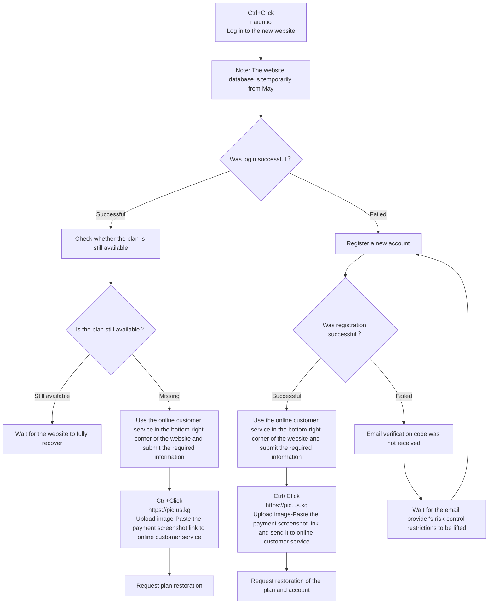

🇨🇳 [中文](README.md) | 🇺🇸 English | 🇷🇺 [Русский](README_RU.md) | 🇮🇷 [فارسی](README_FA.md)

# Naiyun VPN Official Address (Updated August 22, 2026)

Naiyun VPN Official Website Address</br>
`Unexpected outage on 6/30, signs of recovery appeared on 7/1. Enter the ⬇️⬇️ new official website and follow the ⬇️⬇️ process to restore your account. On 7/5, the blogger's own annual plan was successfully restored.`</br>
Account & Plan Recovery Tutorial: [recovery](https://github.com/jdnei/naiyun#recovery)</br>
Latest Address 01: [naiun.io](https://to.iix.im/ny04)</br>
Latest Address 02: [naiun.org](https://to.iix.im/ny03)</br>
Official Website Address: [naiun.one](https://to.iix.im/ny02)</br>
Permanent Address: [naiun.online](https://to.iix.im/ny01)</br>

Recommended VPN Services and Node Sharing for 2026: https://github.com/jdnei/JiChangTuiJian</br>

## Telegram VPN Deals Community #AD

[VPN Giveaway Group](https://331024.de/archives/choujiang)｜[VPN Chat Group](https://331024.de/archives/choujiang)｜[VPN Trial Group](https://331024.de/archives/choujiang)</br>

https://331024.de/archives/choujiang

## Introduction

“Naiyun” is a professional network route optimization service that supports 86 access points worldwide and provides [US Residential IP](https://github.com/jdnei/naiyun#1%E7%BE%8E%E5%9B%BD), [Hong Kong Residential IP](https://github.com/jdnei/naiyun#2%E9%A6%99%E6%B8%AF), [Taiwan Residential IP](https://github.com/jdnei/naiyun#3%E5%8F%B0%E6%B9%BE), [Japan Residential IP](https://github.com/jdnei/naiyun#4%E6%97%A5%E6%9C%AC), [South Korea Residential IP](https://github.com/jdnei/naiyun#5%E9%9F%A9%E5%9B%BD), and Malaysia Residential IP nodes. It is designed to provide stable network acceleration for cross-border work, overseas academic research, and streaming enthusiasts.

## Naiyun VPN Invitation Code

`Users who register with this invitation code can receive a free 10-day/50GB plan`

```bash
QPB5cCmr
```

## Naiyun VPN Discount Code

`Valid until July 20, 2026 at 23:59`

```bash
RENEW_NAIUN_ONE
```

After the free period ends, new users can use a one-time discount code on their first annual subscription, reducing the price from ~~¥168/year~~ to XX yuan/year for one year of service.


## Plans

| Plan Name                       | Price   | Billing Method | Monthly Traffic/Total Traffic | Validity      | Supported Devices | Speed Limit | Dedicated-Line Network | Streaming Unlock | Data Center Rack | Account Sharing | Notes                                                                 |
| ------------------------------- | ------- | -------------- | ----------------------------- | ------------- | ----------------- | ----------- | ---------------------- | ---------------- | ---------------- | --------------- | --------------------------------------------------------------------- |
| Basic-Basic Plan(Special Offer) | ¥168.00 | Annually       | 168G                          | Annual        | 5 devices         | 5000M       | Available              | Supported        | Yes              | Not Allowed     | Automatically resets on the order date                                |
| Pro-Advanced Plan               | ¥38.00  | Monthly        | 388G                          | Monthly       | 5 devices         | 5000M       | Available              | Supported        | Yes              | Not Allowed     | Automatically resets on the order date                                |
| Max-Professional Plan           | ¥58.00  | Monthly        | 788G                          | Monthly       | 5 devices         | 5000M       | Available              | Supported        | Yes              | Not Allowed     | Automatically resets on the order date                                |
| 280G [Pay-As-You-Go]            | ¥98.00  | One-time       | 280G                          | No time limit | 5 devices         | 5000M       | Available              | Supported        | Yes              | Not Allowed     | Valid until traffic is used up; multiple purchases cannot be combined |
| 680G [Pay-As-You-Go]            | ¥258.00 | One-time       | 680G                          | No time limit | 5 devices         | 5000M       | Available              | Supported        | Yes              | Not Allowed     | Valid until traffic is used up; multiple purchases cannot be combined |

## Advantages

Global Coverage: 86 global POP access points are deployed, covering Southeast Asia, Europe, the Americas, and several less-common regions.</br>
Enterprise-Grade Routes: Uses Global Accelerator international dedicated-line technology, with SLA high-availability guarantees across all nodes.</br>
Ultra-HD Support: Optimized transmission efficiency for mainstream 4K/8K video streaming services with extremely low latency.</br>

## 📊 Performance Tests and Analysis

#### 1. Peak-Hour Speed Test Performance


#### 2. Streaming Unlock Report


#### 3. Exit Node and Entry Route Analysis


#### 4. Residential IP Purity Analysis

##### 1. United States


##### 2. Hong Kong


##### 3. Taiwan


##### 4. Japan


##### 5. South Korea


#### 5. Server Status Summary

<details>
<summary><strong>Click to Expand Server List</strong></summary>   

| Group     | Name                                                                     | Protocol | Multiplier | Status      | Load |
| --------- | ------------------------------------------------------------------------ | -------- | ---------- | ----------- | ---- |
| HK        | 🇭🇰 HKG·Hong Kong01 ¹ˣ                                                  | TROJAN   | x1.0       | Online      | 11%  |
| HK        | 🇭🇰 HKG·Hong Kong02 ¹ˣ                                                  | TROJAN   | x1.0       | Online      | 11%  |
| HK        | 🇭🇰 HKG·Hong Kong03 ¹ˣ                                                  | TROJAN   | x1.0       | Online      | 11%  |
| HK        | 🇭🇰 HKG·Hong Kong04 ¹ˣ                                                  | TROJAN   | x1.0       | Online      | 11%  |
| HK        | 🇭🇰 HKG·Hong Kong05 ¹ˣ                                                  | TROJAN   | x1.0       | Online      | 11%  |
| HK        | 🇭🇰 HKG·Hong Kong01 ³ˣ                                                  | TROJAN   | x3.0       | Online      | 56%  |
| HK        | 🇭🇰 HKG·Hong Kong02 ³ˣ                                                  | TROJAN   | x3.0       | Online      | 56%  |
| HK        | 🇭🇰 HKG·Hong Kong03 ³ˣ                                                  | TROJAN   | x3.0       | Online      | 56%  |
| HK        | 🇭🇰 HKG·Hong Kong05 ³ˣ                                                  | TROJAN   | x3.0       | Online      | 56%  |
| HK        | 🇭🇰 HKG·Hong Kong06 ³ˣ                                                  | TROJAN   | x3.0       | Online      | 56%  |
| HK        | 🇭🇰 HKG·Hong Kong07 ³ˣ                                                  | TROJAN   | x3.0       | Online      | 56%  |
| HK        | 🇭🇰 HKG·Hong Kong08 ³ˣ                                                  | TROJAN   | x3.0       | Online      | 56%  |
| HK        | 🇭🇰 HKG·Hong Kong09 ³ˣ                                                  | TROJAN   | x3.0       | Online      | 56%  |
| HK        | 🇭🇰 HKG·Hong Kong10 ³ˣ                                                  | TROJAN   | x3.0       | Online      | 56%  |
| HK        | 🇭🇰 HKG·Hong Kong ISP-Residential ³ˣ                                    | TROJAN   | x3.0       | Online      | 56%  |
| US        | 🇺🇸 USA·United States01 ¹ˣ                                              | TROJAN   | x1.0       | Online      | 11%  |
| US        | 🇺🇸 USA·United States02 ¹ˣ                                              | TROJAN   | x1.0       | Online      | 11%  |
| US        | 🇺🇸 USA·United States03 ¹ˣ                                              | TROJAN   | x1.0       | Online      | 11%  |
| US        | 🇺🇸 USA·United States04 ¹ˣ                                              | TROJAN   | x1.0       | Online      | 11%  |
| US        | 🇺🇸 USA·United States05 ¹ˣ                                              | TROJAN   | x1.0       | Online      | 11%  |
| US        | 🇺🇸 USA·United States01 ³ˣ                                              | TROJAN   | x3.0       | Online      | 56%  |
| US        | 🇺🇸 USA·United States02 ³ˣ                                              | TROJAN   | x3.0       | Online      | 56%  |
| US        | 🇺🇸 USA·United States03 ³ˣ                                              | TROJAN   | x3.0       | Online      | 56%  |
| US        | 🇺🇸 USA·United States05 ³ˣ                                              | TROJAN   | x3.0       | Online      | 56%  |
| US        | 🇺🇸 USA·United States06 ³ˣ                                              | TROJAN   | x3.0       | Online      | 56%  |
| US        | 🇺🇸 USA·United States07 ³ˣ                                              | TROJAN   | x3.0       | Online      | 56%  |
| US        | 🇺🇸 USA·United States08 ³ˣ                                              | TROJAN   | x3.0       | Online      | 56%  |
| US        | 🇺🇸 USA·United States09 ³ˣ                                              | TROJAN   | x3.0       | Online      | 56%  |
| US        | 🇺🇸 USA·United States10 ³ˣ                                              | TROJAN   | x3.0       | Online      | 56%  |
| US        | 🇺🇸 USA·United States ISP-Residential ³ˣ                                | TROJAN   | x3.0       | Online      | 56%  |
| US        | 🇹🇼 TWN·Taiwan02 ³ˣ                                                     | TROJAN   | x3.0       | Online      | 56%  |
| TW        | 🇹🇼 TWN·Taiwan01 ¹ˣ                                                     | TROJAN   | x1.0       | Online      | 11%  |
| TW        | 🇹🇼 TWN·Taiwan02 ¹ˣ                                                     | TROJAN   | x1.0       | Online      | 11%  |
| TW        | 🇹🇼 TWN·Taiwan01 ³ˣ                                                     | TROJAN   | x3.0       | Online      | 56%  |
| TW        | 🇹🇼 TWN·Taiwan03 ³ˣ                                                     | TROJAN   | x3.0       | Online      | 56%  |
| TW        | 🇹🇼 TWN·Taiwan05 ³ˣ                                                     | TROJAN   | x3.0       | Online      | 56%  |
| TW        | 🇹🇼 TWN·Taiwan06 ³ˣ                                                     | TROJAN   | x3.0       | Online      | 56%  |
| TW        | 🇹🇼 TWN·Taiwan07 ³ˣ                                                     | TROJAN   | x3.0       | Online      | 56%  |
| TW        | 🇹🇼 TWN·Taiwan08 ³ˣ                                                     | TROJAN   | x3.0       | Online      | 56%  |
| TW        | 🇹🇼 TWN·Taiwan ISP-Residential ³ˣ                                       | TROJAN   | x3.0       | Online      | 56%  |
| SG        | 🇸🇬 SGP·Singapore01 ¹ˣ                                                  | TROJAN   | x1.0       | Online      | 11%  |
| SG        | 🇸🇬 SGP·Singapore02 ¹ˣ                                                  | TROJAN   | x1.0       | Online      | 11%  |
| SG        | 🇸🇬 SGP·Singapore01 ³ˣ                                                  | TROJAN   | x3.0       | Online      | 56%  |
| SG        | 🇸🇬 SGP·Singapore02 ³ˣ                                                  | TROJAN   | x3.0       | Online      | 56%  |
| SG        | 🇸🇬 SGP·Singapore03 ³ˣ                                                  | TROJAN   | x3.0       | Online      | 56%  |
| SG        | 🇸🇬 SGP·Singapore05 ³ˣ                                                  | TROJAN   | x3.0       | Online      | 56%  |
| SG        | 🇸🇬 SGP·Singapore06 ³ˣ                                                  | TROJAN   | x3.0       | Online      | 56%  |
| JP        | 🇯🇵 JPN·Japan01 ¹ˣ                                                      | TROJAN   | x1.0       | Online      | 11%  |
| JP        | 🇯🇵 JPN·Japan02 ¹ˣ                                                      | TROJAN   | x1.0       | Online      | 11%  |
| JP        | 🇯🇵 JPN·Japan01 ³ˣ                                                      | TROJAN   | x3.0       | Online      | 56%  |
| JP        | 🇯🇵 JPN·Japan02 ³ˣ                                                      | TROJAN   | x3.0       | Online      | 56%  |
| JP        | 🇯🇵 JPN·Japan03 ³ˣ                                                      | TROJAN   | x3.0       | Online      | 56%  |
| JP        | 🇯🇵 JPN·Japan05 ³ˣ                                                      | TROJAN   | x3.0       | Online      | 56%  |
| JP        | 🇯🇵 JPN·Japan06 ³ˣ                                                      | TROJAN   | x3.0       | Online      | 56%  |
| JP        | 🇯🇵 JPN·Japan ISP-Residential ³ˣ                                        | TROJAN   | x3.0       | Online      | 56%  |
| KR        | 🇰🇷 KOR·South Korea01 ¹ˣ                                                | TROJAN   | x1.0       | Online      | 11%  |
| KR        | 🇰🇷 KOR·South Korea02 ¹ˣ                                                | TROJAN   | x1.0       | Online      | 11%  |
| KR        | 🇰🇷 KOR·South Korea01 ³ˣ                                                | TROJAN   | x3.0       | Online      | 56%  |
| KR        | 🇰🇷 KOR·South Korea02 ³ˣ                                                | TROJAN   | x3.0       | Online      | 56%  |
| KR        | 🇰🇷 KOR·South Korea03 ³ˣ                                                | TROJAN   | x3.0       | Online      | 56%  |
| KR        | 🇰🇷 KOR·South Korea05 ³ˣ                                                | TROJAN   | x3.0       | Online      | 56%  |
| KR        | 🇰🇷 KOR·South Korea06 ³ˣ                                                | TROJAN   | x3.0       | Online      | 56%  |
| KR        | 🇰🇷 KOR·South Korea ISP-Residential ³ˣ                                  | TROJAN   | x3.0       | Online      | 56%  |
| TH        | 🇹🇭 THA·Thailand01 ³ˣ                                                   | TROJAN   | x3.0       | Online      | 56%  |
| TH        | 🇹🇭 THA·Thailand02 ³ˣ                                                   | TROJAN   | x3.0       | Online      | 56%  |
| TH        | 🇹🇭 THA·Thailand03 ³ˣ                                                   | TROJAN   | x3.0       | Online      | 56%  |
| MY        | 🇲🇾 MYS·Malaysia01 ³ˣ                                                   | TROJAN   | x3.0       | Online      | 56%  |
| MY        | 🇲🇾 MYS·Malaysia ISP-Residential ³ˣ                                     | TROJAN   | x3.0       | Online      | 56%  |
| VN        | 🇻🇳 VNM·Vietnam01 ³ˣ                                                    | TROJAN   | x3.0       | Online      | 56%  |
| PH        | 🇵🇭 PHL·Philippines01 ³ˣ                                                | TROJAN   | x3.0       | Online      | 56%  |
| ID        | 🇮🇩 IDN·Indonesia01 ³ˣ                                                  | TROJAN   | x3.0       | Online      | 56%  |
| TR        | 🇹🇷 TUR·Turkey01 ³ˣ                                                     | TROJAN   | x3.0       | Online      | 56%  |
| TR        | 🇹🇷 TUR·Turkey02 ³ˣ                                                     | TROJAN   | x3.0       | Online      | 56%  |
| TR        | 🇹🇷 TUR·Turkey03 ³ˣ                                                     | TROJAN   | x3.0       | Online      | 56%  |
| GB        | 🇬🇧 GBR·United Kingdom01 ³ˣ                                             | TROJAN   | x3.0       | Online      | 56%  |
| GB        | 🇬🇧 GBR·United Kingdom02 ³ˣ                                             | TROJAN   | x3.0       | Online      | 56%  |
| GB        | 🇬🇧 GBR·United Kingdom03 ³ˣ                                             | TROJAN   | x3.0       | Online      | 56%  |
| DE        | 🇩🇪 DEU·Germany01 ³ˣ                                                    | TROJAN   | x3.0       | Online      | 56%  |
| FR        | 🇫🇷 FRA·France01 ³ˣ                                                     | TROJAN   | x3.0       | Online      | 56%  |
| BR        | 🇧🇷 BRA·Brazil01 ³ˣ                                                     | TROJAN   | x3.0       | Online      | 56%  |
| AE        | 🇦🇪 ARE·United Arab Emirates01 ³ˣ                                       | TROJAN   | x3.0       | Online      | 56%  |
| Ungrouped | 🇨🇳If a node becomes unavailable, please try updating your subscription | VMESS    | x3.0       | Maintenance | —    |
| Ungrouped | 🇨🇳Permanent Address: [WWW.V2NY.COM](https://github.com/jdnei/naiyun)   | VMESS    | x3.0       | Maintenance | —    |
| Ungrouped | 🇨🇳Mainland China Access: v13.v2ny.me                                   | VMESS    | x3.0       | Maintenance | —    |
| Ungrouped | 🇨🇳[Official]👇Telegram Group👇                                         | VMESS    | x3.0       | Maintenance | —    |
| Ungrouped | 🇨🇳Welcome to join👉@V2NAIUN👈                                          | VMESS    | x3.0       | Maintenance | —    |

</details>

## Recovery

### Account & Plan Recovery Tutorial

`Please copy the following content and send it to customer support. Provide all information at once whenever possible so the issue can be handled as quickly as possible.`</br>
`Do not open another support ticket.`</br>

```bash
Issue Type: (Missing order / Recharge not credited / Plan abnormality )
Account:
(Registered email address or username)
Plan Name:
Purchase/Renewal Time:
(Please enter the exact date and time)
Order Amount:
Payment Method:
(Such as Alipay or WeChat)
Issue Description:
(Please describe the issue in detail and when it occurred)
Attachment:
Screenshot of payment receipt

```


```mermaid
flowchart TD
    A["Ctrl+Click<br/>naiun.io<br/>Log in to the new website"]
    A --> C[Note: The website database is temporarily from May]
    C --> D{Was login successful？}

    D -->|Successful| E[Check whether the plan is still available]
    E --> F{Is the plan still available？}

    F -->|Still available| G[Wait for the website to fully recover]
    F -->|Missing| H[Use the online customer service in the bottom-right corner of the website and submit the required information]
    H --> I["Ctrl+Click<br/>https://pic.us.kg<br/>Upload image-Paste the payment screenshot link to online customer service"]
    I --> J[Request plan restoration]

    D -->|Failed| K[Register a new account]
    K --> L{Was registration successful？}

    L -->|Successful| M[Use the online customer service in the bottom-right corner of the website and submit the required information]
    M --> N["Ctrl+Click<br/>https://pic.us.kg<br/>Upload image-Paste the payment screenshot link and send it to online customer service"]
    N --> O[Request restoration of the plan and account]

    L -->|Failed| P[Email verification code was not received]
    P --> Q[Wait for the email provider's risk-control restrictions to be lifted]
    Q --> K

    click A "https://naiun.io/#/register?code=KacwlzHN" "Open naiun.io" _blank
    click I "https://pic.us.kg" "Open pic.us.kg" _blank
    click N "https://pic.us.kg" "Open pic.us.kg" _blank
```
