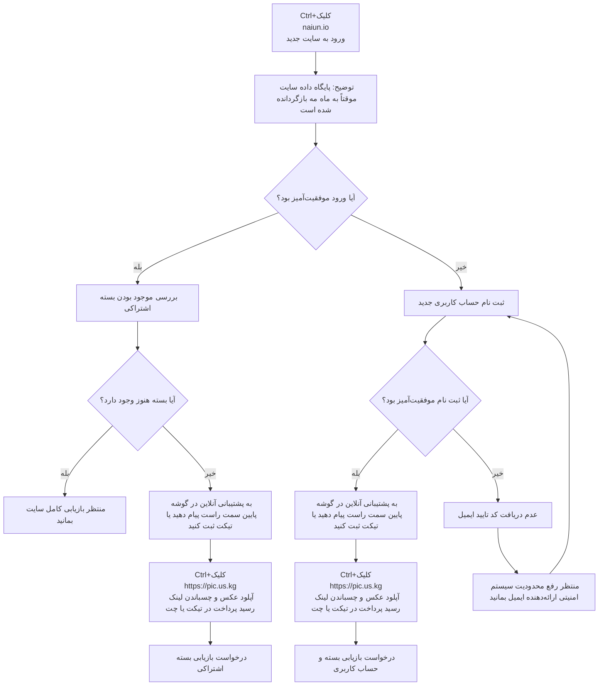

 🇨🇳 [中文](README.md) | 🇺🇸 [English](README_EN.md) | 🇷🇺 [Русский](README_RU.md) | 🇮🇷 فارسی


# آدرس رسمی نای‌یون (naiyun) - به‌روزرسانی در ۶ ژوئیه ۲۰۲۶

آدرس وب‌سایت رسمی نای‌یون (naiyun)
`قطعی ناگهانی ارتباط در ۶.۳۰، شروع روند بهبود از ۷.۱. وارد وب‌سایت رسمی جدید (⬇️⬇️) شوید و مراحل (⬇️⬇️) را برای بازیابی دنبال کنید. تا تاریخ ۷.۵، اشتراک سالانه شخص وبلاگ‌نویس با موفقیت بازیابی شده است.`
آموزش بازیابی حساب و اشتراک: [recovery](https://github.com/jdnei/naiyun#recovery)
جدیدترین آدرس ۰۱: [naiun.io](https://naiun.io/#/register?code=QPB5cCmr)
جدیدترین آدرس ۰۲: [naiun.org](https://naiun.org/#/register?code=QPB5cCmr)
آدرس سایت اصلی: [naiun.one](https://naiun.one/#/register?code=QPB5cCmr)
آدرس دائمی: [naiun.online](https://naiun.online/#/register?code=QPB5cCmr)

معرفی بهترین فیلترشکن‌ها/آجرپرت‌ها و اشتراک‌گذاری سرورها در سال ۲۰۲۶: [https://github.com/jdnei/JiChangTuiJian](https://github.com/jdnei/JiChangTuiJian)

## کانال رفاهی فیلترشکن و پروکسی تلگرام #AD

[گروه قرعه‌کشی](https://331024.de/archives/choujiang)｜[گروه چت و گفتگو](https://331024.de/archives/choujiang)｜[گروه تست رایگان](https://331024.de/archives/choujiang)

[https://331024.de/archives/choujiang](https://331024.de/archives/choujiang)

## معرفی

«نای‌یون» یک سرویس حرفه‌ای بهینه‌سازی زنجیره شبکه است که از ۸۶ نقطه دسترسی جهانی پشتیبانی می‌کند و دارای آی‌پی‌های بومی خانگی (ISP) در [آمریکا](https://github.com/jdnei/naiyun#1%E7%BE%8E%E5%9B%BD)، [هنگ کنگ](https://github.com/jdnei/naiyun#2%E9%A6%99%E6%B8%AF)، [تایوان](https://github.com/jdnei/naiyun#3%E5%8F%B0%E6%B9%BE)، [ژاپن](https://github.com/jdnei/naiyun#4%E6%97%A5%E6%9C%AC)، [کره جنوبی](https://github.com/jdnei/naiyun#5%E9%9F%A9%E5%9B%BD) و مالزی است. این سرویس با هدف ارائه شتاب‌دهنده شبکه پایدار برای دفاتر فرامرزی، جستجوهای آکادمیک بین‌المللی و علاقه‌مندان به فیلم و رسانه طراحی شده است.

## کد معرف نای‌یون (Naiyun)

`با ثبت‌نام از طریق این کد معرف، می‌توانید بسته ۱۰ روزه / ۵۰ گیگابایتی رایگان دریافت کنید`

```bash
QPB5cCmr

```

## کد تخفیف نای‌یون (Naiyun)

`معتبر تا تاریخ ۲۰ ژوئیه ۲۰۲۶، ساعت ۲۳:۵۹`

```bash
RENEW_NAIUN_ONE

```

پس از پایان دوره رایگان، کاربران جدید می‌توانند در اولین سفارش سالانه خود از این کد تخفیف استفاده کنند تا هزینه اشتراک یک‌ساله از ~~۱۶۸ یوان/سال~~ به XX یوان/سال کاهش یابد.

## پلن‌ها (بسته‌ها)

| نام پلن | قیمت | روش پرداخت | ترافیک ماهانه / کل | مدت اعتبار | تعداد دستگاه | سقف سرعت | شبکه اختصاصی | بازگشایی استریم | سرور اختصاصی | اشتراک‌گذاری | توضیحات |
| --- | --- | --- | --- | --- | --- | --- | --- | --- | --- | --- | --- |
| Basic (تخفیف ویژه) | ۱۶۸.۰۰ یوان | سالانه | 168G | ۱ سال | ۵ | 5000M | موجود | پشتیبانی می‌شود | دارد | ممنوع | تمدید خودکار در روز سفارش |
| Pro | ۳۸.۰۰ یوان | ماهانه | 388G | ۱ ماه | ۵ | 5000M | موجود | پشتیبانی می‌شود | دارد | ممنوع | تمدید خودکار در روز سفارش |
| Max | ۵۸.۰۰ یوان | ماهانه | 788G | ۱ ماه | ۵ | 5000M | موجود | پشتیبانی می‌شود | دارد | ممنوع | تمدید خودکار در روز سفارش |
| بسته ۲۸۰ گیگابایتی | ۹۸.۰۰ یوان | یک‌بار مصرف | 280G | بدون محدودیت زمانی | ۵ | 5000M | موجود | پشتیبانی می‌شود | دارد | ممنوع | معتبر تا اتمام حجم؛ خرید مجدد همپوشانی ندارد |
| بسته ۶۸۰ گیگابایتی | ۲۵۸.۰۰ یوان | یک‌بار مصرف | 680G | بدون محدودیت زمانی | ۵ | 5000M | موجود | پشتیبانی می‌شود | دارد | ممنوع | معتبر تا اتمام حجم؛ خرید مجدد همپوشانی ندارد |

## مزایا

پوشش جهانی: راه‌اندازی ۸۶ نقطه دسترسی POP جهانی، شامل جنوب شرقی آسیا، اروپا، آمریکا و برخی مناطق کمیاب.
خطوط سطح سازمانی: استفاده از فناوری خط اختصاصی بین‌المللی Global Accelerator با تضمین پایداری بالا (SLA) در تمام نودها.
پشتیبانی از رزرولوشن فوق‌العاده بالا: بهینه‌سازی کارایی انتقال برای استریم‌های ویدیویی اصلی 4K/8K با تاخیر (پینگ) بسیار کم.

## 📊 تست عملکرد و تحلیل

#### ۱. وضعیت سرعت در ساعات اوج مصرف شبانه

#### ۲. گزارش وضعیت بازگشایی سرویس‌های استریم

#### ۳. تحلیل نودهای ورودی و خروجی

#### ۴. تحلیل کیفیت و خلوص آی‌پی‌های خانگی (ISP)

##### ۱. ایالات متحده آمریکا

##### ۲. هنگ کنگ

##### ۳. تایوان

##### ۴. ژاپن

##### ۵. کره جنوبی

#### ۵. لیست وضعیت سرورها

| گروه | نام نود | پروتکل | ضریب مصرف | وضعیت | میزان بار |
| --- | --- | --- | --- | --- | --- |
| HK | 🇭🇰 HKG·هنگ کنگ 01 ¹ˣ | TROJAN | x1.0 | آنلاین | ۱۱٪ |
| HK | 🇭🇰 HKG·هنگ کنگ 02 ¹ˣ | TROJAN | x1.0 | آنلاین | ۱۱٪ |
| HK | 🇭🇰 HKG·هنگ کنگ 03 ¹ˣ | TROJAN | x1.0 | آنلاین | ۱۱٪ |
| HK | 🇭🇰 HKG·هنگ کنگ 04 ¹ˣ | TROJAN | x1.0 | آنلاین | ۱۱٪ |
| HK | 🇭🇰 HKG·هنگ کنگ 05 ¹ˣ | TROJAN | x1.0 | آنلاین | ۱۱٪ |
| HK | 🇭🇰 HKG·هنگ کنگ 01 ³ˣ | TROJAN | x3.0 | آنلاین | ۵۶٪ |
| HK | 🇭🇰 HKG·هنگ کنگ 02 ³ˣ | TROJAN | x3.0 | آنلاین | ۵۶٪ |
| HK | 🇭🇰 HKG·هنگ کنگ 03 ³ˣ | TROJAN | x3.0 | آنلاین | ۵۶٪ |
| HK | 🇭🇰 HKG·هنگ کنگ 05 ³ˣ | TROJAN | x3.0 | آنلاین | ۵۶٪ |
| HK | 🇭🇰 HKG·هنگ کنگ 06 ³ˣ | TROJAN | x3.0 | آنلاین | ۵۶٪ |
| HK | 🇭🇰 HKG·هنگ کنگ 07 ³ˣ | TROJAN | x3.0 | آنلاین | ۵۶٪ |
| HK | 🇭🇰 HKG·هنگ کنگ 08 ³ˣ | TROJAN | x3.0 | آنلاین | ۵۶٪ |
| HK | 🇭🇰 HKG·هنگ کنگ 09 ³ˣ | TROJAN | x3.0 | آنلاین | ۵۶٪ |
| HK | 🇭🇰 HKG·هنگ کنگ 10 ³ˣ | TROJAN | x3.0 | آنلاین | ۵۶٪ |
| HK | 🇭🇰 HKG·هنگ کنگ ISP-خانگی ³ˣ | TROJAN | x3.0 | آنلاین | ۵۶٪ |
| US | 🇺🇸 USA·آمریکا 01 ¹ˣ | TROJAN | x1.0 | آنلاین | ۱۱٪ |
| US | 🇺🇸 USA·آمریکا 02 ¹ˣ | TROJAN | x1.0 | آنلاین | ۱۱٪ |
| US | 🇺🇸 USA·آمریکا 03 ¹ˣ | TROJAN | x1.0 | آنلاین | ۱۱٪ |
| US | 🇺🇸 USA·آمریکا 04 ¹ˣ | TROJAN | x1.0 | آنلاین | ۱۱٪ |
| US | 🇺🇸 USA·آمریکا 05 ¹ˣ | TROJAN | x1.0 | آنلاین | ۱۱٪ |
| US | 🇺🇸 USA·آمریکا 01 ³ˣ | TROJAN | x3.0 | آنلاین | ۵۶٪ |
| US | 🇺🇸 USA·آمریکا 02 ³ˣ | TROJAN | x3.0 | آنلاین | ۵۶٪ |
| US | 🇺🇸 USA·آمریکا 03 ³ˣ | TROJAN | x3.0 | آنلاین | ۵۶٪ |
| US | 🇺🇸 USA·آمریکا 05 ³ˣ | TROJAN | x3.0 | آنلاین | ۵۶٪ |
| US | 🇺🇸 USA·آمریکا 06 ³ˣ | TROJAN | x3.0 | آنلاین | ۵۶٪ |
| US | 🇺🇸 USA·آمریکا 07 ³ˣ | TROJAN | x3.0 | آنلاین | ۵۶٪ |
| US | 🇺🇸 USA·آمریکا 08 ³ˣ | TROJAN | x3.0 | آنلاین | ۵۶٪ |
| US | 🇺🇸 USA·آمریکا 09 ³ˣ | TROJAN | x3.0 | آنلاین | ۵۶٪ |
| US | 🇺🇸 USA·آمریکا 10 ³ˣ | TROJAN | x3.0 | آنلاین | ۵۶٪ |
| US | 🇺🇸 USA·آمریکا ISP-خانگی ³ˣ | TROJAN | x3.0 | آنلاین | ۵۶٪ |
| TW | 🇹🇼 TWN·تایوان 02 ³ˣ | TROJAN | x3.0 | آنلاین | ۵۶٪ |
| TW | 🇹🇼 TWN·تایوان 01 ¹ˣ | TROJAN | x1.0 | آنلاین | ۱۱٪ |
| TW | 🇹🇼 TWN·تایوان 02 ¹ˣ | TROJAN | x1.0 | آنلاین | ۱۱٪ |
| TW | 🇹🇼 TWN·تایوان 01 ³ˣ | TROJAN | x3.0 | آنلاین | ۵۶٪ |
| TW | 🇹🇼 TWN·تایوان 03 ³ˣ | TROJAN | x3.0 | آنلاین | ۵۶٪ |
| TW | 🇹🇼 TWN·تایوان 05 ³ˣ | TROJAN | x3.0 | آنلاین | ۵۶٪ |
| TW | 🇹🇼 TWN·تایوان 06 ³ˣ | TROJAN | x3.0 | آنلاین | ۵۶٪ |
| TW | 🇹🇼 TWN·تایوان 07 ³ˣ | TROJAN | x3.0 | آنلاین | ۵۶٪ |
| TW | 🇹🇼 TWN·تایوان 08 ³ˣ | TROJAN | x3.0 | آنلاین | ۵۶٪ |
| TW | 🇹🇼 TWN·تایوان ISP-خانگی ³ˣ | TROJAN | x3.0 | آنلاین | ۵۶٪ |
| SG | 🇸🇬 SGP·سنگاپور 01 ¹ˣ | TROJAN | x1.0 | آنلاین | ۱۱٪ |
| SG | 🇸🇬 SGP·سنگاپور 02 ¹ˣ | TROJAN | x1.0 | آنلاین | ۱۱٪ |
| SG | 🇸🇬 SGP·سنگاپور 01 ³ˣ | TROJAN | x3.0 | آنلاین | ۵۶٪ |
| SG | 🇸🇬 SGP·سنگاپور 02 ³ˣ | TROJAN | x3.0 | آنلاین | ۵۶٪ |
| SG | 🇸🇬 SGP·سنگاپور 03 ³ˣ | TROJAN | x3.0 | آنلاین | ۵۶٪ |
| SG | 🇸🇬 SGP·سنگاپور 05 ³ˣ | TROJAN | x3.0 | آنلاین | ۵۶٪ |
| SG | 🇸🇬 SGP·سنگاپور 06 ³ˣ | TROJAN | x3.0 | آنلاین | ۵۶٪ |
| JP | 🇯🇵 JPN·ژاپن 01 ¹ˣ | TROJAN | x1.0 | آنلاین | ۱۱٪ |
| JP | 🇯🇵 JPN·ژاپن 02 ¹ˣ | TROJAN | x1.0 | آنلاین | ۱۱٪ |
| JP | 🇯🇵 JPN·ژاپن 01 ³ˣ | TROJAN | x3.0 | آنلاین | ۵۶٪ |
| JP | 🇯🇵 JPN·ژاپن 02 ³ˣ | TROJAN | x3.0 | آنلاین | ۵۶٪ |
| JP | 🇯🇵 JPN·ژاپن 03 ³ˣ | TROJAN | x3.0 | آنلاین | ۵۶٪ |
| JP | 🇯🇵 JPN·ژاپن 05 ³ˣ | TROJAN | x3.0 | آنلاین | ۵۶٪ |
| JP | 🇯🇵 JPN·ژاپن 06 ³ˣ | TROJAN | x3.0 | آنلاین | ۵۶٪ |
| JP | 🇯🇵 JPN·ژاپن ISP-خانگی ³ˣ | TROJAN | x3.0 | آنلاین | ۵۶٪ |
| KR | 🇰🇷 KOR·کره جنوبی 01 ¹ˣ | TROJAN | x1.0 | آنلاین | ۱۱٪ |
| KR | 🇰🇷 KOR·کره جنوبی 02 ¹ˣ | TROJAN | x1.0 | آنلاین | ۱۱٪ |
| KR | 🇰🇷 KOR·کره جنوبی 01 ³ˣ | TROJAN | x3.0 | آنلاین | ۵۶٪ |
| KR | 🇰🇷 KOR·کره جنوبی 02 ³ˣ | TROJAN | x3.0 | آنلاین | ۵۶٪ |
| KR | 🇰🇷 KOR·کره جنوبی 03 ³ˣ | TROJAN | x3.0 | آنلاین | ۵۶٪ |
| KR | 🇰🇷 KOR·کره جنوبی 05 ³ˣ | TROJAN | x3.0 | آنلاین | ۵۶٪ |
| KR | 🇰🇷 KOR·کره جنوبی 06 ³ˣ | TROJAN | x3.0 | آنلاین | ۵۶٪ |
| KR | 🇰🇷 KOR·کره جنوبی ISP-خانگی ³ˣ | TROJAN | x3.0 | آنلاین | ۵۶٪ |
| TH | 🇹🇭 THA·تایلند 01 ³ˣ | TROJAN | x3.0 | آنلاین | ۵۶٪ |
| TH | 🇹🇭 THA·تایلند 02 ³ˣ | TROJAN | x3.0 | آنلاین | ۵۶٪ |
| TH | 🇹🇭 THA·تایلند 03 ³ˣ | TROJAN | x3.0 | آنلاین | ۵۶٪ |
| MY | 🇲🇾 MYS·مالزی 01 ³ˣ | TROJAN | x3.0 | آنلاین | ۵۶٪ |
| MY | 🇲🇾 MYS·مالزی ISP-خانگی ³ˣ | TROJAN | x3.0 | آنلاین | ۵۶٪ |
| VN | 🇻🇳 VNM·ویتنام 01 ³ˣ | TROJAN | x3.0 | آنلاین | ۵۶٪ |
| PH | 🇵🇭 PHL·فیلیپین 01 ³ˣ | TROJAN | x3.0 | آنلاین | ۵۶٪ |
| ID | 🇮🇩 IDN·اندونزی 01 ³ˣ | TROJAN | x3.0 | آنلاین | ۵۶٪ |
| TR | 🇹🇷 TUR·ترکیه 01 ³ˣ | TROJAN | x3.0 | آنلاین | ۵۶٪ |
| TR | 🇹🇷 TUR·ترکیه 02 ³ˣ | TROJAN | x3.0 | آنلاین | ۵۶٪ |
| TR | 🇹🇷 TUR·ترکیه 03 ³ˣ | TROJAN | x3.0 | آنلاین | ۵۶٪ |
| GB | 🇬🇧 GBR·بریتانیا 01 ³ˣ | TROJAN | x3.0 | آنلاین | ۵۶٪ |
| GB | 🇬🇧 GBR·بریتانیا 02 ³ˣ | TROJAN | x3.0 | آنلاین | ۵۶٪ |
| GB | 🇬🇧 GBR·بریتانیا 03 ³ˣ | TROJAN | x3.0 | آنلاین | ۵۶٪ |
| DE | 🇩🇪 DEU·آلمان 01 ³ˣ | TROJAN | x3.0 | آنلاین | ۵۶٪ |
| FR | 🇫🇷 FRA·فرانسه 01 ³ˣ | TROJAN | x3.0 | آنلاین | ۵۶٪ |
| BR | 🇧🇷 BRA·برزیل 01 ³ˣ | TROJAN | x3.0 | آنلاین | ۵۶٪ |
| AE | 🇦🇪 ARE·امارات 01 ³ˣ | TROJAN | x3.0 | آنلاین | ۵۶٪ |
| نامشخص | 🇨🇳 در صورت خرابی نودها، لطفاً لینک سابکشن را به‌روزرسانی کنید | VMESS | x3.0 | در حال تعمیر | — |
| نامشخص | 🇨🇳 آدرس دائمی: [WWW.V2NY.COM](https://github.com/jdnei/naiyun) | VMESS | x3.0 | در حال تعمیر | — |
| نامشخص | 🇨🇳 دسترسی از چین: v13.v2ny.me | VMESS | x3.0 | در حال تعمیر | — |
| نامشخص | 🇨🇳 [رسمی] 👇 گروه تلگرام 👇 | VMESS | x3.0 | در حال تعمیر | — |
| نامشخص | 🇨🇳 به ما بپیوندید 👉 @V2NAIUN 👈 | VMESS | x3.0 | در حال تعمیر | — |

## Recovery

### آموزش بازیابی حساب و اشتراک

`حق تفسیر این فرآیند متعلق به مقامات رسمی نای‌یون است. در حال حاضر، ارتباط با پشتیبانی آنلاین سایت سریع‌ترین راه است؛ حتماً پیگیری کنید. نویسنده وبلاگ شخصاً تست کرده و اشتراک اکنون بازیابی شده است.`


