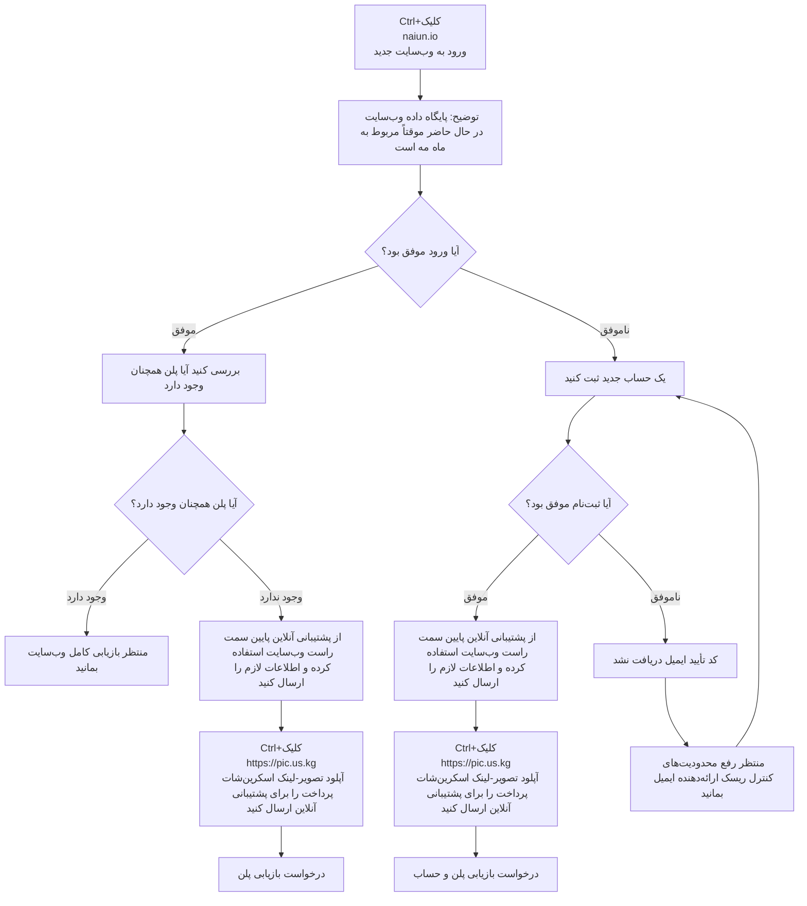

 🇨🇳 [中文](README.md) | 🇺🇸 [English](README_EN.md) | 🇷🇺 [Русский](README_RU.md) | 🇮🇷 فارسی

# آدرس رسمی Naiyun VPN (به‌روزرسانی 10 اوت 2026)

آدرس وب‌سایت رسمی Naiyun VPN</br>
`در 6.30 سرویس به‌طور ناگهانی از دسترس خارج شد، در 7.1 نشانه‌هایی از بهبود دیده شد. وارد ⬇️⬇️ وب‌سایت رسمی جدید شوید و طبق روند ⬇️⬇️ حساب خود را بازیابی کنید. در 7.5 پلن سالانه شخصی نویسنده با موفقیت بازیابی شد.`</br>
آموزش بازیابی حساب و پلن: [recovery](https://github.com/jdnei/naiyun#recovery)</br>
جدیدترین آدرس 01: [naiun.io](https://to.iix.im/ny04)</br>
جدیدترین آدرس 02: [naiun.org](https://to.iix.im/ny03)</br>
آدرس وب‌سایت رسمی: [naiun.one](https://to.iix.im/ny02)</br>
آدرس دائمی: [naiun.online](https://to.iix.im/ny01)</br>

معرفی VPNهای پیشنهادی و اشتراک‌گذاری نودهای مناسب در سال 2026: https://github.com/jdnei/JiChangTuiJian</br>

## انجمن تخفیف و مزایای VPN در Telegram #AD

[گروه قرعه‌کشی VPN](https://331024.de/archives/choujiang)｜[گروه گفت‌وگوی VPN](https://331024.de/archives/choujiang)｜[گروه تست VPN](https://331024.de/archives/choujiang)</br>

https://331024.de/archives/choujiang

## معرفی

“Naiyun” یک سرویس حرفه‌ای بهینه‌سازی مسیر شبکه است که از 86 نقطه دسترسی در سراسر جهان پشتیبانی می‌کند و دارای نودهای [IP خانگی آمریکا](https://github.com/jdnei/naiyun#1%E7%BE%8E%E5%9B%BD)، [IP خانگی هنگ‌کنگ](https://github.com/jdnei/naiyun#2%E9%A6%99%E6%B8%AF)، [IP خانگی تایوان](https://github.com/jdnei/naiyun#3%E5%8F%B0%E6%B9%BE)، [IP خانگی ژاپن](https://github.com/jdnei/naiyun#4%E6%97%A5%E6%9C%AC)، [IP خانگی کره جنوبی](https://github.com/jdnei/naiyun#5%E9%9F%A9%E5%9B%BD) و IP خانگی مالزی است. این سرویس برای ارائه اتصال پایدار و بهینه به کاربران فعال در کارهای برون‌مرزی، جست‌وجوهای علمی بین‌المللی و علاقه‌مندان به محتوای ویدیویی طراحی شده است.

## کد دعوت Naiyun VPN

`کاربرانی که با این کد دعوت ثبت‌نام کنند می‌توانند یک پلن رایگان 10 روزه/50GB دریافت کنند`

```bash
QPB5cCmr
```

## کد تخفیف Naiyun VPN

`معتبر تا ساعت 23:59 روز 20 ژوئیه 2026`

```bash
RENEW_NAIUN_ONE
```

پس از پایان دوره رایگان، کاربران جدید می‌توانند برای اولین خرید اشتراک سالانه یک بار از کد تخفیف استفاده کنند و قیمت ~~¥168/سال~~ را به XX یوان/سال کاهش دهند و یک سال سرویس خریداری کنند.


## پلن‌ها

| نام پلن                    | قیمت    | روش پرداخت     | ترافیک ماهانه/کل ترافیک | مدت استفاده        | تعداد دستگاه‌های پشتیبانی‌شده | سقف سرعت | شبکه خط اختصاصی | رفع محدودیت استریم | رک دیتاسنتر | اشتراک‌گذاری حساب | توضیحات                                                    |
| -------------------------- | ------- | -------------- | ----------------------- | ------------------ | ----------------------------- | -------- | --------------- | ------------------ | ----------- | ----------------- | ---------------------------------------------------------- |
| Basic-پلن پایه(تخفیف ویژه) | ¥168.00 | سالانه         | 168G                    | سالانه             | 5 دستگاه                      | 5000M    | قابل استفاده    | پشتیبانی می‌شود    | دارد        | مجاز نیست         | در تاریخ سفارش به‌صورت خودکار ریست می‌شود                  |
| Pro-پلن پیشرفته            | ¥38.00  | ماهانه         | 388G                    | ماهانه             | 5 دستگاه                      | 5000M    | قابل استفاده    | پشتیبانی می‌شود    | دارد        | مجاز نیست         | در تاریخ سفارش به‌صورت خودکار ریست می‌شود                  |
| Max-پلن حرفه‌ای            | ¥58.00  | ماهانه         | 788G                    | ماهانه             | 5 دستگاه                      | 5000M    | قابل استفاده    | پشتیبانی می‌شود    | دارد        | مجاز نیست         | در تاریخ سفارش به‌صورت خودکار ریست می‌شود                  |
| 280G [پرداخت بر اساس مصرف] | ¥98.00  | پرداخت یک‌باره | 280G                    | بدون محدودیت زمانی | 5 دستگاه                      | 5000M    | قابل استفاده    | پشتیبانی می‌شود    | دارد        | مجاز نیست         | تا پایان ترافیک معتبر است؛ خریدهای متعدد قابل تجمیع نیستند |
| 680G [پرداخت بر اساس مصرف] | ¥258.00 | پرداخت یک‌باره | 680G                    | بدون محدودیت زمانی | 5 دستگاه                      | 5000M    | قابل استفاده    | پشتیبانی می‌شود    | دارد        | مجاز نیست         | تا پایان ترافیک معتبر است؛ خریدهای متعدد قابل تجمیع نیستند |

## مزایا

پوشش جهانی: دارای 86 نقطه دسترسی POP در سراسر جهان است که جنوب شرق آسیا، اروپا، آمریکا و تعدادی از مناطق کمیاب را پوشش می‌دهد.</br>
مسیرهای سازمانی: از فناوری خطوط اختصاصی بین‌المللی Global Accelerator استفاده می‌کند و تمام نودها دارای تضمین دسترس‌پذیری بالای SLA هستند.</br>
پشتیبانی Ultra-HD: انتقال داده برای سرویس‌های اصلی پخش ویدیوی 4K/8K بهینه شده و تأخیر بسیار پایینی دارد.</br>

## 📊 تست عملکرد و تحلیل

#### 1. عملکرد تست سرعت در ساعات اوج مصرف


#### 2. گزارش رفع محدودیت سرویس‌های استریم


#### 3. تحلیل ورودی مسیر و نود خروجی


#### 4. تحلیل پاکی IP خانگی

##### 1. آمریکا


##### 2. هنگ‌کنگ


##### 3. تایوان


##### 4. ژاپن


##### 5. کره جنوبی


#### 5. خلاصه وضعیت سرورها

<details>
<summary><strong>برای باز کردن فهرست سرورها کلیک کنید</strong></summary>   

| گروه      | نام                                                             | پروتکل | ضریب | وضعیت        | بار |
| --------- | --------------------------------------------------------------- | ------ | ---- | ------------ | --- |
| HK        | 🇭🇰 HKG·هنگ‌کنگ01 ¹ˣ                                           | TROJAN | x1.0 | آنلاین       | 11% |
| HK        | 🇭🇰 HKG·هنگ‌کنگ02 ¹ˣ                                           | TROJAN | x1.0 | آنلاین       | 11% |
| HK        | 🇭🇰 HKG·هنگ‌کنگ03 ¹ˣ                                           | TROJAN | x1.0 | آنلاین       | 11% |
| HK        | 🇭🇰 HKG·هنگ‌کنگ04 ¹ˣ                                           | TROJAN | x1.0 | آنلاین       | 11% |
| HK        | 🇭🇰 HKG·هنگ‌کنگ05 ¹ˣ                                           | TROJAN | x1.0 | آنلاین       | 11% |
| HK        | 🇭🇰 HKG·هنگ‌کنگ01 ³ˣ                                           | TROJAN | x3.0 | آنلاین       | 56% |
| HK        | 🇭🇰 HKG·هنگ‌کنگ02 ³ˣ                                           | TROJAN | x3.0 | آنلاین       | 56% |
| HK        | 🇭🇰 HKG·هنگ‌کنگ03 ³ˣ                                           | TROJAN | x3.0 | آنلاین       | 56% |
| HK        | 🇭🇰 HKG·هنگ‌کنگ05 ³ˣ                                           | TROJAN | x3.0 | آنلاین       | 56% |
| HK        | 🇭🇰 HKG·هنگ‌کنگ06 ³ˣ                                           | TROJAN | x3.0 | آنلاین       | 56% |
| HK        | 🇭🇰 HKG·هنگ‌کنگ07 ³ˣ                                           | TROJAN | x3.0 | آنلاین       | 56% |
| HK        | 🇭🇰 HKG·هنگ‌کنگ08 ³ˣ                                           | TROJAN | x3.0 | آنلاین       | 56% |
| HK        | 🇭🇰 HKG·هنگ‌کنگ09 ³ˣ                                           | TROJAN | x3.0 | آنلاین       | 56% |
| HK        | 🇭🇰 HKG·هنگ‌کنگ10 ³ˣ                                           | TROJAN | x3.0 | آنلاین       | 56% |
| HK        | 🇭🇰 HKG·هنگ‌کنگ ISP-خانگی ³ˣ                                   | TROJAN | x3.0 | آنلاین       | 56% |
| US        | 🇺🇸 USA·آمریکا01 ¹ˣ                                            | TROJAN | x1.0 | آنلاین       | 11% |
| US        | 🇺🇸 USA·آمریکا02 ¹ˣ                                            | TROJAN | x1.0 | آنلاین       | 11% |
| US        | 🇺🇸 USA·آمریکا03 ¹ˣ                                            | TROJAN | x1.0 | آنلاین       | 11% |
| US        | 🇺🇸 USA·آمریکا04 ¹ˣ                                            | TROJAN | x1.0 | آنلاین       | 11% |
| US        | 🇺🇸 USA·آمریکا05 ¹ˣ                                            | TROJAN | x1.0 | آنلاین       | 11% |
| US        | 🇺🇸 USA·آمریکا01 ³ˣ                                            | TROJAN | x3.0 | آنلاین       | 56% |
| US        | 🇺🇸 USA·آمریکا02 ³ˣ                                            | TROJAN | x3.0 | آنلاین       | 56% |
| US        | 🇺🇸 USA·آمریکا03 ³ˣ                                            | TROJAN | x3.0 | آنلاین       | 56% |
| US        | 🇺🇸 USA·آمریکا05 ³ˣ                                            | TROJAN | x3.0 | آنلاین       | 56% |
| US        | 🇺🇸 USA·آمریکا06 ³ˣ                                            | TROJAN | x3.0 | آنلاین       | 56% |
| US        | 🇺🇸 USA·آمریکا07 ³ˣ                                            | TROJAN | x3.0 | آنلاین       | 56% |
| US        | 🇺🇸 USA·آمریکا08 ³ˣ                                            | TROJAN | x3.0 | آنلاین       | 56% |
| US        | 🇺🇸 USA·آمریکا09 ³ˣ                                            | TROJAN | x3.0 | آنلاین       | 56% |
| US        | 🇺🇸 USA·آمریکا10 ³ˣ                                            | TROJAN | x3.0 | آنلاین       | 56% |
| US        | 🇺🇸 USA·آمریکا ISP-خانگی ³ˣ                                    | TROJAN | x3.0 | آنلاین       | 56% |
| US        | 🇹🇼 TWN·تایوان02 ³ˣ                                            | TROJAN | x3.0 | آنلاین       | 56% |
| TW        | 🇹🇼 TWN·تایوان01 ¹ˣ                                            | TROJAN | x1.0 | آنلاین       | 11% |
| TW        | 🇹🇼 TWN·تایوان02 ¹ˣ                                            | TROJAN | x1.0 | آنلاین       | 11% |
| TW        | 🇹🇼 TWN·تایوان01 ³ˣ                                            | TROJAN | x3.0 | آنلاین       | 56% |
| TW        | 🇹🇼 TWN·تایوان03 ³ˣ                                            | TROJAN | x3.0 | آنلاین       | 56% |
| TW        | 🇹🇼 TWN·تایوان05 ³ˣ                                            | TROJAN | x3.0 | آنلاین       | 56% |
| TW        | 🇹🇼 TWN·تایوان06 ³ˣ                                            | TROJAN | x3.0 | آنلاین       | 56% |
| TW        | 🇹🇼 TWN·تایوان07 ³ˣ                                            | TROJAN | x3.0 | آنلاین       | 56% |
| TW        | 🇹🇼 TWN·تایوان08 ³ˣ                                            | TROJAN | x3.0 | آنلاین       | 56% |
| TW        | 🇹🇼 TWN·تایوان ISP-خانگی ³ˣ                                    | TROJAN | x3.0 | آنلاین       | 56% |
| SG        | 🇸🇬 SGP·سنگاپور01 ¹ˣ                                           | TROJAN | x1.0 | آنلاین       | 11% |
| SG        | 🇸🇬 SGP·سنگاپور02 ¹ˣ                                           | TROJAN | x1.0 | آنلاین       | 11% |
| SG        | 🇸🇬 SGP·سنگاپور01 ³ˣ                                           | TROJAN | x3.0 | آنلاین       | 56% |
| SG        | 🇸🇬 SGP·سنگاپور02 ³ˣ                                           | TROJAN | x3.0 | آنلاین       | 56% |
| SG        | 🇸🇬 SGP·سنگاپور03 ³ˣ                                           | TROJAN | x3.0 | آنلاین       | 56% |
| SG        | 🇸🇬 SGP·سنگاپور05 ³ˣ                                           | TROJAN | x3.0 | آنلاین       | 56% |
| SG        | 🇸🇬 SGP·سنگاپور06 ³ˣ                                           | TROJAN | x3.0 | آنلاین       | 56% |
| JP        | 🇯🇵 JPN·ژاپن01 ¹ˣ                                              | TROJAN | x1.0 | آنلاین       | 11% |
| JP        | 🇯🇵 JPN·ژاپن02 ¹ˣ                                              | TROJAN | x1.0 | آنلاین       | 11% |
| JP        | 🇯🇵 JPN·ژاپن01 ³ˣ                                              | TROJAN | x3.0 | آنلاین       | 56% |
| JP        | 🇯🇵 JPN·ژاپن02 ³ˣ                                              | TROJAN | x3.0 | آنلاین       | 56% |
| JP        | 🇯🇵 JPN·ژاپن03 ³ˣ                                              | TROJAN | x3.0 | آنلاین       | 56% |
| JP        | 🇯🇵 JPN·ژاپن05 ³ˣ                                              | TROJAN | x3.0 | آنلاین       | 56% |
| JP        | 🇯🇵 JPN·ژاپن06 ³ˣ                                              | TROJAN | x3.0 | آنلاین       | 56% |
| JP        | 🇯🇵 JPN·ژاپن ISP-خانگی ³ˣ                                      | TROJAN | x3.0 | آنلاین       | 56% |
| KR        | 🇰🇷 KOR·کره جنوبی01 ¹ˣ                                         | TROJAN | x1.0 | آنلاین       | 11% |
| KR        | 🇰🇷 KOR·کره جنوبی02 ¹ˣ                                         | TROJAN | x1.0 | آنلاین       | 11% |
| KR        | 🇰🇷 KOR·کره جنوبی01 ³ˣ                                         | TROJAN | x3.0 | آنلاین       | 56% |
| KR        | 🇰🇷 KOR·کره جنوبی02 ³ˣ                                         | TROJAN | x3.0 | آنلاین       | 56% |
| KR        | 🇰🇷 KOR·کره جنوبی03 ³ˣ                                         | TROJAN | x3.0 | آنلاین       | 56% |
| KR        | 🇰🇷 KOR·کره جنوبی05 ³ˣ                                         | TROJAN | x3.0 | آنلاین       | 56% |
| KR        | 🇰🇷 KOR·کره جنوبی06 ³ˣ                                         | TROJAN | x3.0 | آنلاین       | 56% |
| KR        | 🇰🇷 KOR·کره جنوبی ISP-خانگی ³ˣ                                 | TROJAN | x3.0 | آنلاین       | 56% |
| TH        | 🇹🇭 THA·تایلند01 ³ˣ                                            | TROJAN | x3.0 | آنلاین       | 56% |
| TH        | 🇹🇭 THA·تایلند02 ³ˣ                                            | TROJAN | x3.0 | آنلاین       | 56% |
| TH        | 🇹🇭 THA·تایلند03 ³ˣ                                            | TROJAN | x3.0 | آنلاین       | 56% |
| MY        | 🇲🇾 MYS·مالزی01 ³ˣ                                             | TROJAN | x3.0 | آنلاین       | 56% |
| MY        | 🇲🇾 MYS·مالزی ISP-خانگی ³ˣ                                     | TROJAN | x3.0 | آنلاین       | 56% |
| VN        | 🇻🇳 VNM·ویتنام01 ³ˣ                                            | TROJAN | x3.0 | آنلاین       | 56% |
| PH        | 🇵🇭 PHL·فیلیپین01 ³ˣ                                           | TROJAN | x3.0 | آنلاین       | 56% |
| ID        | 🇮🇩 IDN·اندونزی01 ³ˣ                                           | TROJAN | x3.0 | آنلاین       | 56% |
| TR        | 🇹🇷 TUR·ترکیه01 ³ˣ                                             | TROJAN | x3.0 | آنلاین       | 56% |
| TR        | 🇹🇷 TUR·ترکیه02 ³ˣ                                             | TROJAN | x3.0 | آنلاین       | 56% |
| TR        | 🇹🇷 TUR·ترکیه03 ³ˣ                                             | TROJAN | x3.0 | آنلاین       | 56% |
| GB        | 🇬🇧 GBR·بریتانیا01 ³ˣ                                          | TROJAN | x3.0 | آنلاین       | 56% |
| GB        | 🇬🇧 GBR·بریتانیا02 ³ˣ                                          | TROJAN | x3.0 | آنلاین       | 56% |
| GB        | 🇬🇧 GBR·بریتانیا03 ³ˣ                                          | TROJAN | x3.0 | آنلاین       | 56% |
| DE        | 🇩🇪 DEU·آلمان01 ³ˣ                                             | TROJAN | x3.0 | آنلاین       | 56% |
| FR        | 🇫🇷 FRA·فرانسه01 ³ˣ                                            | TROJAN | x3.0 | آنلاین       | 56% |
| BR        | 🇧🇷 BRA·برزیل01 ³ˣ                                             | TROJAN | x3.0 | آنلاین       | 56% |
| AE        | 🇦🇪 ARE·امارات متحده عربی01 ³ˣ                                 | TROJAN | x3.0 | آنلاین       | 56% |
| بدون گروه | 🇨🇳اگر یک نود از دسترس خارج شد، اشتراک خود را به‌روزرسانی کنید | VMESS  | x3.0 | در حال تعمیر | —   |
| بدون گروه | 🇨🇳آدرس دائمی: [WWW.V2NY.COM](https://github.com/jdnei/naiyun) | VMESS  | x3.0 | در حال تعمیر | —   |
| بدون گروه | 🇨🇳دسترسی از سرزمین اصلی چین: v13.v2ny.me                      | VMESS  | x3.0 | در حال تعمیر | —   |
| بدون گروه | 🇨🇳[رسمی]👇گروه Telegram👇                                     | VMESS  | x3.0 | در حال تعمیر | —   |
| بدون گروه | 🇨🇳به ما بپیوندید👉@V2NAIUN👈                                  | VMESS  | x3.0 | در حال تعمیر | —   |

</details>

## Recovery

### آموزش بازیابی حساب و پلن

`لطفاً متن زیر را کپی کرده و برای پشتیبانی ارسال کنید و تا حد امکان تمام اطلاعات را در یک پیام ارائه دهید تا درخواست شما سریع‌تر بررسی شود.`</br>
`تیکت جدید دیگری باز نکنید.`</br>

```bash
نوع مشکل: (حذف سفارش / شارژ به حساب اضافه نشده / مشکل در پلن )
حساب:
(ایمیل ثبت‌نام یا نام کاربری)
نام پلن:
زمان خرید/تمدید:
(لطفاً تاریخ و ساعت دقیق را وارد کنید)
مبلغ سفارش:
روش پرداخت:
(مانند Alipay یا WeChat)
شرح مشکل:
(لطفاً مشکل و زمان وقوع آن را با جزئیات توضیح دهید)
پیوست:
اسکرین‌شات رسید پرداخت

```


```mermaid
flowchart TD
    A["Ctrl+کلیک<br/>naiun.io<br/>ورود به وب‌سایت جدید"]
    A --> C[توضیح: پایگاه داده وب‌سایت در حال حاضر موقتاً مربوط به ماه مه است]
    C --> D{آیا ورود موفق بود؟}

    D -->|موفق| E[بررسی کنید آیا پلن همچنان وجود دارد]
    E --> F{آیا پلن همچنان وجود دارد؟}

    F -->|وجود دارد| G[منتظر بازیابی کامل وب‌سایت بمانید]
    F -->|وجود ندارد| H[از پشتیبانی آنلاین پایین سمت راست وب‌سایت استفاده کرده و اطلاعات لازم را ارسال کنید]
    H --> I["Ctrl+کلیک<br/>https://pic.us.kg<br/>آپلود تصویر-لینک اسکرین‌شات پرداخت را برای پشتیبانی آنلاین ارسال کنید"]
    I --> J[درخواست بازیابی پلن]

    D -->|ناموفق| K[یک حساب جدید ثبت کنید]
    K --> L{آیا ثبت‌نام موفق بود؟}

    L -->|موفق| M[از پشتیبانی آنلاین پایین سمت راست وب‌سایت استفاده کرده و اطلاعات لازم را ارسال کنید]
    M --> N["Ctrl+کلیک<br/>https://pic.us.kg<br/>آپلود تصویر-لینک اسکرین‌شات پرداخت را برای پشتیبانی آنلاین ارسال کنید"]
    N --> O[درخواست بازیابی پلن و حساب]

    L -->|ناموفق| P[کد تأیید ایمیل دریافت نشد]
    P --> Q[منتظر رفع محدودیت‌های کنترل ریسک ارائه‌دهنده ایمیل بمانید]
    Q --> K

    click A "https://naiun.io/#/register?code=KacwlzHN" "باز کردن naiun.io" _blank
    click I "https://pic.us.kg" "باز کردن pic.us.kg" _blank
    click N "https://pic.us.kg" "باز کردن pic.us.kg" _blank
```
