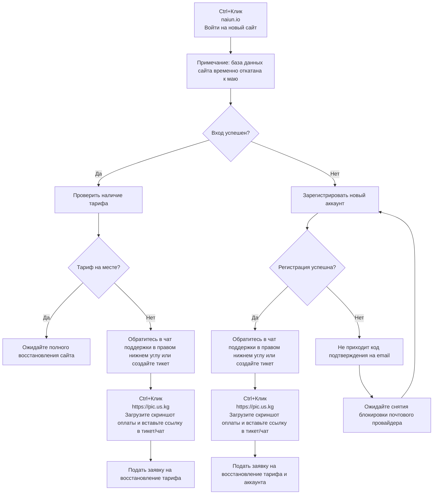

🇨🇳 [中文](README.md) | 🇺🇸 [English](README_EN.md) | 🇷🇺 Русский | 🇮🇷 [فارسی](README_FA.md)

# Официальный адрес naiyun (обновлено 19 июля 2026)

Адрес официального сайта naiyun</br>
`30.06 произошел внезапный сбой сети, 01.07 наметился перелом к лучшему. Перейдите на ⬇️⬇️ новый сайт и следуйте инструкции ⬇️⬇️ для восстановления. По состоянию на 05.07 годовая подписка автора блога полностью восстановлена.`</br>
Инструкция по восстановлению аккаунта и подписки: [recovery](https://github.com/jdnei/naiyun#recovery)</br>
Актуальный адрес 01: [naiun.io](https://naiun.io/#/register?code=QPB5cCmr)</br>
Актуальный адрес 02: [naiun.org](https://naiun.org/#/register?code=QPB5cCmr)</br>
Официальный домен: [naiun.one](https://naiun.one/#/register?code=QPB5cCmr)</br>
Постоянный адрес: [naiun.online](https://naiun.online/#/register?code=QPB5cCmr)</br>

Рейтинг лучших VPN/Socks5-провайдеров и раздача узлов 2026: [https://github.com/jdnei/JiChangTuiJian](https://github.com/jdnei/JiChangTuiJian)

## Клуб бенефитов Telegram VPN #AD

[Группа с розыгрышами](https://331024.de/archives/choujiang)｜[Чат сообщества](https://331024.de/archives/choujiang)｜[Тестовый доступ](https://331024.de/archives/choujiang)

[https://331024.de/archives/choujiang](https://331024.de/archives/choujiang)

## Описание

«Naiyun» — это профессиональный сервис оптимизации сетевых каналов, поддерживающий 86 точек глобального доступа и предлагающий резидентные провайдерские (ISP) IP-адреса в [США](https://github.com/jdnei/naiyun#1%E7%BE%8E%E5%9B%BD), [Гонконге](https://github.com/jdnei/naiyun#2%E9%A6%99%E6%B8%AF), [Тайване](https://github.com/jdnei/naiyun#3%E5%8F%B0%E6%B9%BE), [Японии](https://github.com/jdnei/naiyun#4%E6%97%A5%E6%9C%AC), [Южной Корее](https://github.com/jdnei/naiyun#5%E9%9F%A9%E5%9B%BD) и Малайзии. Создан для обеспечения стабильного ускорения сети для трансграничной работы, зарубежного академического поиска и любителей потокового мультимедиа.

## Реферальный код Naiyun

`Используйте этот промокод при регистрации, чтобы бесплатно получить тариф на 10 дней / 50 ГБ`

```bash
QPB5cCmr

```

## Промокод на скидку Naiyun

`Срок действия до 20 июля 2026 года, 23:59`

```bash
RENEW_NAIUN_ONE

```

После окончания бесплатного периода новые пользователи могут применить этот промокод при первом оформлении годовой подписки, чтобы снизить стоимость с ~~168 юаней/год~~ до ХХ юаней/год.

## Тарифные планы

| Название тарифа | Цена | Тип оплаты | Объем трафика | Срок действия | Устройств | Ограничение скорости | Выделенная линия | Разблок. стриминга | Выделенный сервер | Общий доступ | Примечание |
| --- | --- | --- | --- | --- | --- | --- | --- | --- | --- | --- | --- |
| Basic (Спецпредложение) | ¥168.00 | Раз в год | 168G | 1 год | 5 | 5000M | Доступно | Поддерживается | Есть | Запрещено | Автообновление в день заказа |
| Pro | ¥38.00 | Ежемесячно | 388G | 1 месяц | 5 | 5000M | Доступно | Поддерживается | Есть | Запрещено | Автообновление в день заказа |
| Max | ¥58.00 | Ежемесячно | 788G | 1 месяц | 5 | 5000M | Доступно | Поддерживается | Есть | Запрещено | Автообновление в день заказа |
| 280G [По объему] | ¥98.00 | Разово | 280G | Без лимита | 5 | 5000M | Доступно | Поддерживается | Есть | Запрещено | Активен до исчерпания; пакеты не суммируются |
| 680G [По объему] | ¥258.00 | Разово | 680G | Без лимита | 5 | 5000M | Доступно | Поддерживается | Есть | Запрещено | Активен до исчерпания; пакеты не суммируются |

## Преимущества

Глобальное покрытие: Развернуто 86 глобальных точек присутствия (POP), включая Юго-Восточную Азию, Европу, США и редкие регионы.
Каналы корпоративного уровня: Использование международной технологии выделенных линий Global Accelerator с высокой доступностью (SLA) на всех узлах.
Поддержка Ultra-HD: Оптимизированная передача контента для стриминга 4K/8K с минимальной задержкой.

## 📊 Тестирование производительности и анализ

#### 1. Скорость в вечерний час пик

#### 2. Отчет по разблокировке стриминговых сервисов

#### 3. Анализ входных и выходных маршрутов

#### 4. Анализ чистоты резидентных IP (ISP)

##### 1. США

##### 2. Гонконг

##### 3. Тайвань

##### 4. Япония

##### 5. Южная Корея

#### 5. Мониторинг статуса серверов

| Группа | Название локации | Протокол | Коэффициент | Статус | Нагрузка |
| --- | --- | --- | --- | --- | --- |
| HK | 🇭🇰 HKG·Гонконг 01 ¹ˣ | TROJAN | x1.0 | Онлайн | 11% |
| HK | 🇭🇰 HKG·Гонконг 02 ¹ˣ | TROJAN | x1.0 | Онлайн | 11% |
| HK | 🇭🇰 HKG·Гонконг 03 ¹ˣ | TROJAN | x1.0 | Онлайн | 11% |
| HK | 🇭🇰 HKG·Гонконг 04 ¹ˣ | TROJAN | x1.0 | Онлайн | 11% |
| HK | 🇭🇰 HKG·Гонконг 05 ¹ˣ | TROJAN | x1.0 | Онлайн | 11% |
| HK | 🇭🇰 HKG·Гонконг 01 ³ˣ | TROJAN | x3.0 | Онлайн | 56% |
| HK | 🇭🇰 HKG·Гонконг 02 ³ˣ | TROJAN | x3.0 | Онлайн | 56% |
| HK | 🇭🇰 HKG·Гонконг 03 ³ˣ | TROJAN | x3.0 | Онлайн | 56% |
| HK | 🇭🇰 HKG·Гонконг 05 ³ˣ | TROJAN | x3.0 | Онлайн | 56% |
| HK | 🇭🇰 HKG·Гонконг 06 ³ˣ | TROJAN | x3.0 | Онлайн | 56% |
| HK | 🇭🇰 HKG·Гонконг 07 ³ˣ | TROJAN | x3.0 | Онлайн | 56% |
| HK | 🇭🇰 HKG·Гонконг 08 ³ˣ | TROJAN | x3.0 | Онлайн | 56% |
| HK | 🇭🇰 HKG·Гонконг 09 ³ˣ | TROJAN | x3.0 | Онлайн | 56% |
| HK | 🇭🇰 HKG·Гонконг 10 ³ˣ | TROJAN | x3.0 | Онлайн | 56% |
| HK | 🇭🇰 HKG·Гонконг ISP-Резидентский ³ˣ | TROJAN | x3.0 | Онлайн | 56% |
| US | 🇺🇸 USA·США 01 ¹ˣ | TROJAN | x1.0 | Онлайн | 11% |
| US | 🇺🇸 USA·США 02 ¹ˣ | TROJAN | x1.0 | Онлайн | 11% |
| US | 🇺🇸 USA·США 03 ¹ˣ | TROJAN | x1.0 | Онлайн | 11% |
| US | 🇺🇸 USA·США 04 ¹ˣ | TROJAN | x1.0 | Онлайн | 11% |
| US | 🇺🇸 USA·США 05 ¹ˣ | TROJAN | x1.0 | Онлайн | 11% |
| US | 🇺🇸 USA·США 01 ³ˣ | TROJAN | x3.0 | Онлайн | 56% |
| US | 🇺🇸 USA·США 02 ³ˣ | TROJAN | x3.0 | Онлайн | 56% |
| US | 🇺🇸 USA·США 03 ³ˣ | TROJAN | x3.0 | Онлайн | 56% |
| US | 🇺🇸 USA·США 05 ³ˣ | TROJAN | x3.0 | Онлайн | 56% |
| US | 🇺🇸 USA·США 06 ³ˣ | TROJAN | x3.0 | Онлайн | 56% |
| US | 🇺🇸 USA·США 07 ³ˣ | TROJAN | x3.0 | Онлайн | 56% |
| US | 🇺🇸 USA·США 08 ³ˣ | TROJAN | x3.0 | Онлайн | 56% |
| US | 🇺🇸 USA·США 09 ³ˣ | TROJAN | x3.0 | Онлайн | 56% |
| US | 🇺🇸 USA·США 10 ³ˣ | TROJAN | x3.0 | Онлайн | 56% |
| US | 🇺🇸 USA·США ISP-Резидентский ³ˣ | TROJAN | x3.0 | Онлайн | 56% |
| TW | 🇹🇼 TWN·Тайвань 02 ³ˣ | TROJAN | x3.0 | Онлайн | 56% |
| TW | 🇹🇼 TWN·Тайвань 01 ¹ˣ | TROJAN | x1.0 | Онлайн | 11% |
| TW | 🇹🇼 TWN·Тайвань 02 ¹ˣ | TROJAN | x1.0 | Онлайн | 11% |
| TW | 🇹🇼 TWN·Тайвань 01 ³ˣ | TROJAN | x3.0 | Онлайн | 56% |
| TW | 🇹🇼 TWN·Тайвань 03 ³ˣ | TROJAN | x3.0 | Онлайн | 56% |
| TW | 🇹🇼 TWN·Тайвань 05 ³ˣ | TROJAN | x3.0 | Онлайн | 56% |
| TW | 🇹🇼 TWN·Тайвань 06 ³ˣ | TROJAN | x3.0 | Онлайн | 56% |
| TW | 🇹🇼 TWN·Тайвань 07 ³ˣ | TROJAN | x3.0 | Онлайн | 56% |
| TW | 🇹🇼 TWN·Тайвань 08 ³ˣ | TROJAN | x3.0 | Онлайн | 56% |
| TW | 🇹🇼 TWN·Тайвань ISP-Резидентский ³ˣ | TROJAN | x3.0 | Онлайн | 56% |
| SG | 🇸🇬 SGP·Сингапур 01 ¹ˣ | TROJAN | x1.0 | Онлайн | 11% |
| SG | 🇸🇬 SGP·Сингапур 02 ¹ˣ | TROJAN | x1.0 | Онлайн | 11% |
| SG | 🇸🇬 SGP·Сингапур 01 ³ˣ | TROJAN | x3.0 | Онлайн | 56% |
| SG | 🇸🇬 SGP·Сингапур 02 ³ˣ | TROJAN | x3.0 | Онлайн | 56% |
| SG | 🇸🇬 SGP·Сингапур 03 ³ˣ | TROJAN | x3.0 | Онлайн | 56% |
| SG | 🇸🇬 SGP·Сингапур 05 ³ˣ | TROJAN | x3.0 | Онлайн | 56% |
| SG | 🇸🇬 SGP·Сингапур 06 ³ˣ | TROJAN | x3.0 | Онлайн | 56% |
| JP | 🇯🇵 JPN·Япония 01 ¹ˣ | TROJAN | x1.0 | Онлайн | 11% |
| JP | 🇯🇵 JPN·Япония 02 ¹ˣ | TROJAN | x1.0 | Онлайн | 11% |
| JP | 🇯🇵 JPN·Япония 01 ³ˣ | TROJAN | x3.0 | Онлайн | 56% |
| JP | 🇯🇵 JPN·Япония 02 ³ˣ | TROJAN | x3.0 | Онлайн | 56% |
| JP | 🇯🇵 JPN·Япония 03 ³ˣ | TROJAN | x3.0 | Онлайн | 56% |
| JP | 🇯🇵 JPN·Япония 05 ³ˣ | TROJAN | x3.0 | Онлайн | 56% |
| JP | 🇯🇵 JPN·Япония 06 ³ˣ | TROJAN | x3.0 | Онлайн | 56% |
| JP | 🇯🇵 JPN·Япония ISP-Резидентский ³ˣ | TROJAN | x3.0 | Онлайн | 56% |
| KR | 🇰🇷 KOR·Южная Корея 01 ¹ˣ | TROJAN | x1.0 | Онлайн | 11% |
| KR | 🇰🇷 KOR·Южная Корея 02 ¹ˣ | TROJAN | x1.0 | Онлайн | 11% |
| KR | 🇰🇷 KOR·Южная Корея 01 ³ˣ | TROJAN | x3.0 | Онлайн | 56% |
| KR | 🇰🇷 KOR·Южная Корея 02 ³ˣ | TROJAN | x3.0 | Онлайн | 56% |
| KR | 🇰🇷 KOR·Южная Корея 03 ³ˣ | TROJAN | x3.0 | Онлайн | 56% |
| KR | 🇰🇷 KOR·Южная Корея 05 ³ˣ | TROJAN | x3.0 | Онлайн | 56% |
| KR | 🇰🇷 KOR·Южная Корея 06 ³ˣ | TROJAN | x3.0 | Онлайн | 56% |
| KR | 🇰🇷 KOR·Южная Корея ISP-Резидентский ³ˣ | TROJAN | x3.0 | Онлайн | 56% |
| TH | 🇹🇭 THA·Таиланд 01 ³ˣ | TROJAN | x3.0 | Онлайн | 56% |
| TH | 🇹🇭 THA·Таиланд 02 ³ˣ | TROJAN | x3.0 | Онлайн | 56% |
| TH | 🇹🇭 THA·Таиланд 03 ³ˣ | TROJAN | x3.0 | Онлайн | 56% |
| MY | 🇲🇾 MYS·Малайзия 01 ³ˣ | TROJAN | x3.0 | Онлайн | 56% |
| MY | 🇲🇾 MYS·Малайзия ISP-Резидентский ³ˣ | TROJAN | x3.0 | Онлайн | 56% |
| VN | 🇻🇳 VNM·Вьетнам 01 ³ˣ | TROJAN | x3.0 | Онлайн | 56% |
| PH | 🇵🇭 PHL·Филиппины 01 ³ˣ | TROJAN | x3.0 | Онлайн | 56% |
| ID | 🇮🇩 IDN·Индонезия 01 ³ˣ | TROJAN | x3.0 | Онлайн | 56% |
| TR | 🇹🇷 TUR·Турция 01 ³ˣ | TROJAN | x3.0 | Онлайн | 56% |
| TR | 🇹🇷 TUR·Турция 02 ³ˣ | TROJAN | x3.0 | Онлайн | 56% |
| TR | 🇹🇷 TUR·Турция 03 ³ˣ | TROJAN | x3.0 | Онлайн | 56% |
| GB | 🇬🇧 GBR·Великобритания 01 ³ˣ | TROJAN | x3.0 | Онлайн | 56% |
| GB | 🇬🇧 GBR·Великобритания 02 ³ˣ | TROJAN | x3.0 | Онлайн | 56% |
| GB | 🇬🇧 GBR·Великобритания 03 ³ˣ | TROJAN | x3.0 | Онлайн | 56% |
| DE | 🇩🇪 DEU·Германия 01 ³ˣ | TROJAN | x3.0 | Онлайн | 56% |
| FR | 🇫🇷 FRA·Франция 01 ³ˣ | TROJAN | x3.0 | Онлайн | 56% |
| BR | 🇧🇷 BRA·Бразилия 01 ³ˣ | TROJAN | x3.0 | Онлайн | 56% |
| AE | 🇦🇪 ARE·ОАЭ 01 ³ˣ | TROJAN | x3.0 | Онлайн | 56% |
| Без группы | 🇨🇳 Если узлы не работают, обновите подписку | VMESS | x3.0 | Обслуживание | — |
| Без группы | 🇨🇳 Постоянный домен: [WWW.V2NY.COM](https://github.com/jdnei/naiyun) | VMESS | x3.0 | Обслуживание | — |
| Без группы | 🇨🇳 Доступ из материка: v13.v2ny.me | VMESS | x3.0 | Обслуживание | — |
| Без группы | 🇨🇳 [Офиц.] 👇 Группа в Telegram 👇 | VMESS | x3.0 | Обслуживание | — |
| Без группы | 🇨🇳 Добро пожаловать 👉 @V2NAIUN 👈 | VMESS | x3.0 | Обслуживание | — |

## Recovery

### Инструкция по восстановлению аккаунта и тарифа

`Право на интерпретацию данного процесса принадлежит администрации Naiyun. На данный момент быстрее всего вопросы решаются через онлайн-чат поддержки на сайте. Пожалуйста, напоминайте им о себе. Проверено автором блога лично — тариф успешно восстановлен.`


