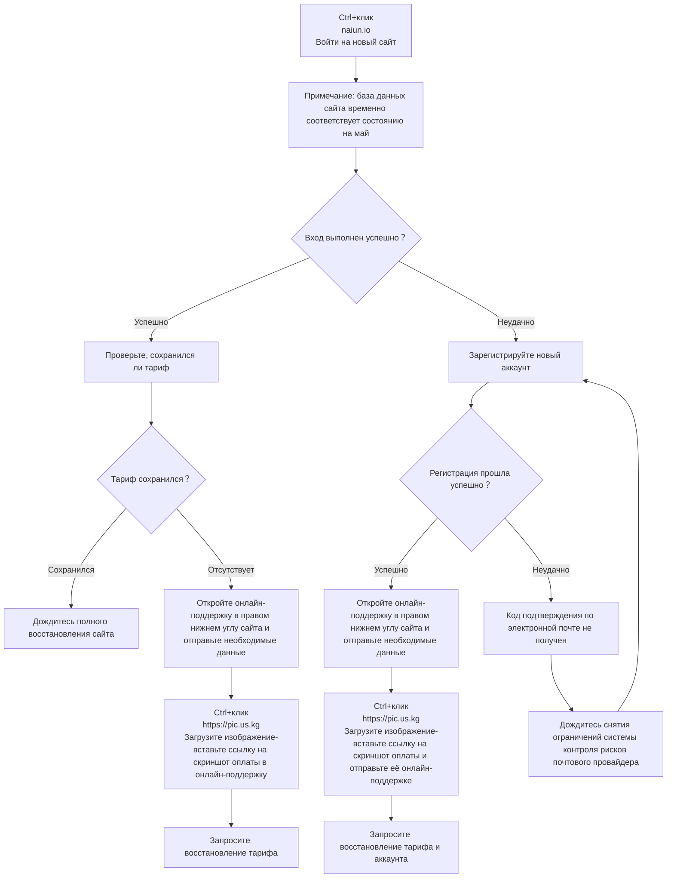

🇨🇳 [中文](README.md) | 🇺🇸 [English](README_EN.md) | 🇷🇺 Русский | 🇮🇷 [فارسی](README_FA.md)

# Официальный адрес Naiyun VPN (обновлено 7 августа 2026)

Адрес официального сайта Naiyun VPN</br>
`30.06 сервис внезапно пропал из сети, 01.07 появились признаки восстановления. Перейдите на ⬇️⬇️ новый официальный сайт и выполните ⬇️⬇️ указанные действия для восстановления. 05.07 годовой тариф самого автора был успешно восстановлен.`</br>
Инструкция по восстановлению аккаунта и тарифа: [recovery](https://github.com/jdnei/naiyun#recovery)</br>
Новый адрес 01: [naiun.io](https://to.iix.im/ny04)</br>
Новый адрес 02: [naiun.org](https://to.iix.im/ny03)</br>
Адрес официального сайта: [naiun.one](https://to.iix.im/ny02)</br>
Постоянный адрес: [naiun.online](https://to.iix.im/ny01)</br>

Рекомендуемые VPN-сервисы и подборка узлов на 2026 год: https://github.com/jdnei/JiChangTuiJian</br>

## Telegram-сообщество с акциями и бонусами VPN #AD

[Группа розыгрышей VPN](https://331024.de/archives/choujiang)｜[Чат VPN](https://331024.de/archives/choujiang)｜[Группа тестирования VPN](https://331024.de/archives/choujiang)</br>

https://331024.de/archives/choujiang

## Описание

“Naiyun” — профессиональный сервис оптимизации сетевых маршрутов, поддерживающий 86 точек доступа по всему миру. Также доступны узлы с [домашними IP США](https://github.com/jdnei/naiyun#1%E7%BE%8E%E5%9B%BD), [домашними IP Гонконга](https://github.com/jdnei/naiyun#2%E9%A6%99%E6%B8%AF), [домашними IP Тайваня](https://github.com/jdnei/naiyun#3%E5%8F%B0%E6%B9%BE), [домашними IP Японии](https://github.com/jdnei/naiyun#4%E6%97%A5%E6%9C%AC), [домашними IP Южной Кореи](https://github.com/jdnei/naiyun#5%E9%9F%A9%E5%9B%BD), а также домашними IP Малайзии. Сервис предназначен для обеспечения стабильного ускоренного соединения при международной работе, зарубежном академическом поиске и просмотре мультимедийного контента.

## Код приглашения Naiyun VPN

`Пользователи, зарегистрировавшиеся с этим кодом приглашения, могут бесплатно получить тариф на 10 дней/50GB`

```bash
QPB5cCmr
```

## Код скидки Naiyun VPN

`Действует до 20 июля 2026 года, 23:59`

```bash
RENEW_NAIUN_ONE
```

После окончания бесплатного периода новые пользователи могут один раз применить код скидки при первой покупке годового тарифа, снизив стоимость с ~~¥168/год~~ до XX юаней/год и получив один год использования сервиса.


## Тарифы

| Название тарифа                      | Цена    | Способ оплаты | Месячный трафик/Общий трафик | Срок использования         | Количество устройств | Ограничение скорости | Выделенная сеть | Разблокировка стриминга | Стойка в дата-центре | Совместное использование аккаунта | Примечание                                                                     |
| ------------------------------------ | ------- | ------------- | ---------------------------- | -------------------------- | -------------------- | -------------------- | --------------- | ----------------------- | -------------------- | --------------------------------- | ------------------------------------------------------------------------------ |
| Basic-Базовый тариф(Спецпредложение) | ¥168.00 | Ежегодно      | 168G                         | Год                        | 5 устройств          | 5000M                | Доступно        | Поддерживается          | Есть                 | Запрещено                         | Автоматический сброс в дату заказа                                             |
| Pro-Продвинутый тариф                | ¥38.00  | Ежемесячно    | 388G                         | Месяц                      | 5 устройств          | 5000M                | Доступно        | Поддерживается          | Есть                 | Запрещено                         | Автоматический сброс в дату заказа                                             |
| Max-Профессиональный тариф           | ¥58.00  | Ежемесячно    | 788G                         | Месяц                      | 5 устройств          | 5000M                | Доступно        | Поддерживается          | Есть                 | Запрещено                         | Автоматический сброс в дату заказа                                             |
| 280G [Оплата по трафику]             | ¥98.00  | Единоразово   | 280G                         | Без ограничения по времени | 5 устройств          | 5000M                | Доступно        | Поддерживается          | Есть                 | Запрещено                         | Действует до полного расходования трафика; несколько покупок нельзя объединить |
| 680G [Оплата по трафику]             | ¥258.00 | Единоразово   | 680G                         | Без ограничения по времени | 5 устройств          | 5000M                | Доступно        | Поддерживается          | Есть                 | Запрещено                         | Действует до полного расходования трафика; несколько покупок нельзя объединить |

## Преимущества

Глобальное покрытие: Развёрнуто 86 глобальных точек доступа POP, охватывающих Юго-Восточную Азию, Европу, Америку и некоторые редкие регионы.</br>
Маршруты корпоративного уровня: Используется технология международных выделенных линий Global Accelerator, а все узлы имеют гарантию высокой доступности SLA.</br>
Поддержка Ultra-HD: Оптимизирована эффективность передачи данных для популярных видеосервисов 4K/8K с крайне низкой задержкой.</br>

## 📊 Тестирование производительности и анализ

#### 1. Результаты теста скорости в часы пик


#### 2. Отчёт о разблокировке стриминговых сервисов


#### 3. Анализ входных маршрутов и выходных узлов


#### 4. Анализ чистоты домашних IP

##### 1. США


##### 2. Гонконг


##### 3. Тайвань


##### 4. Япония


##### 5. Южная Корея


#### 5. Сводка состояния серверов

<details>
<summary><strong>Нажмите, чтобы открыть список серверов</strong></summary>   

| Группа     | Название                                                              | Протокол | Коэффициент | Статус       | Нагрузка |
| ---------- | --------------------------------------------------------------------- | -------- | ----------- | ------------ | -------- |
| HK         | 🇭🇰 HKG·Гонконг01 ¹ˣ                                                 | TROJAN   | x1.0        | Онлайн       | 11%      |
| HK         | 🇭🇰 HKG·Гонконг02 ¹ˣ                                                 | TROJAN   | x1.0        | Онлайн       | 11%      |
| HK         | 🇭🇰 HKG·Гонконг03 ¹ˣ                                                 | TROJAN   | x1.0        | Онлайн       | 11%      |
| HK         | 🇭🇰 HKG·Гонконг04 ¹ˣ                                                 | TROJAN   | x1.0        | Онлайн       | 11%      |
| HK         | 🇭🇰 HKG·Гонконг05 ¹ˣ                                                 | TROJAN   | x1.0        | Онлайн       | 11%      |
| HK         | 🇭🇰 HKG·Гонконг01 ³ˣ                                                 | TROJAN   | x3.0        | Онлайн       | 56%      |
| HK         | 🇭🇰 HKG·Гонконг02 ³ˣ                                                 | TROJAN   | x3.0        | Онлайн       | 56%      |
| HK         | 🇭🇰 HKG·Гонконг03 ³ˣ                                                 | TROJAN   | x3.0        | Онлайн       | 56%      |
| HK         | 🇭🇰 HKG·Гонконг05 ³ˣ                                                 | TROJAN   | x3.0        | Онлайн       | 56%      |
| HK         | 🇭🇰 HKG·Гонконг06 ³ˣ                                                 | TROJAN   | x3.0        | Онлайн       | 56%      |
| HK         | 🇭🇰 HKG·Гонконг07 ³ˣ                                                 | TROJAN   | x3.0        | Онлайн       | 56%      |
| HK         | 🇭🇰 HKG·Гонконг08 ³ˣ                                                 | TROJAN   | x3.0        | Онлайн       | 56%      |
| HK         | 🇭🇰 HKG·Гонконг09 ³ˣ                                                 | TROJAN   | x3.0        | Онлайн       | 56%      |
| HK         | 🇭🇰 HKG·Гонконг10 ³ˣ                                                 | TROJAN   | x3.0        | Онлайн       | 56%      |
| HK         | 🇭🇰 HKG·Гонконг ISP-Домашний ³ˣ                                      | TROJAN   | x3.0        | Онлайн       | 56%      |
| US         | 🇺🇸 USA·США01 ¹ˣ                                                     | TROJAN   | x1.0        | Онлайн       | 11%      |
| US         | 🇺🇸 USA·США02 ¹ˣ                                                     | TROJAN   | x1.0        | Онлайн       | 11%      |
| US         | 🇺🇸 USA·США03 ¹ˣ                                                     | TROJAN   | x1.0        | Онлайн       | 11%      |
| US         | 🇺🇸 USA·США04 ¹ˣ                                                     | TROJAN   | x1.0        | Онлайн       | 11%      |
| US         | 🇺🇸 USA·США05 ¹ˣ                                                     | TROJAN   | x1.0        | Онлайн       | 11%      |
| US         | 🇺🇸 USA·США01 ³ˣ                                                     | TROJAN   | x3.0        | Онлайн       | 56%      |
| US         | 🇺🇸 USA·США02 ³ˣ                                                     | TROJAN   | x3.0        | Онлайн       | 56%      |
| US         | 🇺🇸 USA·США03 ³ˣ                                                     | TROJAN   | x3.0        | Онлайн       | 56%      |
| US         | 🇺🇸 USA·США05 ³ˣ                                                     | TROJAN   | x3.0        | Онлайн       | 56%      |
| US         | 🇺🇸 USA·США06 ³ˣ                                                     | TROJAN   | x3.0        | Онлайн       | 56%      |
| US         | 🇺🇸 USA·США07 ³ˣ                                                     | TROJAN   | x3.0        | Онлайн       | 56%      |
| US         | 🇺🇸 USA·США08 ³ˣ                                                     | TROJAN   | x3.0        | Онлайн       | 56%      |
| US         | 🇺🇸 USA·США09 ³ˣ                                                     | TROJAN   | x3.0        | Онлайн       | 56%      |
| US         | 🇺🇸 USA·США10 ³ˣ                                                     | TROJAN   | x3.0        | Онлайн       | 56%      |
| US         | 🇺🇸 USA·США ISP-Домашний ³ˣ                                          | TROJAN   | x3.0        | Онлайн       | 56%      |
| US         | 🇹🇼 TWN·Тайвань02 ³ˣ                                                 | TROJAN   | x3.0        | Онлайн       | 56%      |
| TW         | 🇹🇼 TWN·Тайвань01 ¹ˣ                                                 | TROJAN   | x1.0        | Онлайн       | 11%      |
| TW         | 🇹🇼 TWN·Тайвань02 ¹ˣ                                                 | TROJAN   | x1.0        | Онлайн       | 11%      |
| TW         | 🇹🇼 TWN·Тайвань01 ³ˣ                                                 | TROJAN   | x3.0        | Онлайн       | 56%      |
| TW         | 🇹🇼 TWN·Тайвань03 ³ˣ                                                 | TROJAN   | x3.0        | Онлайн       | 56%      |
| TW         | 🇹🇼 TWN·Тайвань05 ³ˣ                                                 | TROJAN   | x3.0        | Онлайн       | 56%      |
| TW         | 🇹🇼 TWN·Тайвань06 ³ˣ                                                 | TROJAN   | x3.0        | Онлайн       | 56%      |
| TW         | 🇹🇼 TWN·Тайвань07 ³ˣ                                                 | TROJAN   | x3.0        | Онлайн       | 56%      |
| TW         | 🇹🇼 TWN·Тайвань08 ³ˣ                                                 | TROJAN   | x3.0        | Онлайн       | 56%      |
| TW         | 🇹🇼 TWN·Тайвань ISP-Домашний ³ˣ                                      | TROJAN   | x3.0        | Онлайн       | 56%      |
| SG         | 🇸🇬 SGP·Сингапур01 ¹ˣ                                                | TROJAN   | x1.0        | Онлайн       | 11%      |
| SG         | 🇸🇬 SGP·Сингапур02 ¹ˣ                                                | TROJAN   | x1.0        | Онлайн       | 11%      |
| SG         | 🇸🇬 SGP·Сингапур01 ³ˣ                                                | TROJAN   | x3.0        | Онлайн       | 56%      |
| SG         | 🇸🇬 SGP·Сингапур02 ³ˣ                                                | TROJAN   | x3.0        | Онлайн       | 56%      |
| SG         | 🇸🇬 SGP·Сингапур03 ³ˣ                                                | TROJAN   | x3.0        | Онлайн       | 56%      |
| SG         | 🇸🇬 SGP·Сингапур05 ³ˣ                                                | TROJAN   | x3.0        | Онлайн       | 56%      |
| SG         | 🇸🇬 SGP·Сингапур06 ³ˣ                                                | TROJAN   | x3.0        | Онлайн       | 56%      |
| JP         | 🇯🇵 JPN·Япония01 ¹ˣ                                                  | TROJAN   | x1.0        | Онлайн       | 11%      |
| JP         | 🇯🇵 JPN·Япония02 ¹ˣ                                                  | TROJAN   | x1.0        | Онлайн       | 11%      |
| JP         | 🇯🇵 JPN·Япония01 ³ˣ                                                  | TROJAN   | x3.0        | Онлайн       | 56%      |
| JP         | 🇯🇵 JPN·Япония02 ³ˣ                                                  | TROJAN   | x3.0        | Онлайн       | 56%      |
| JP         | 🇯🇵 JPN·Япония03 ³ˣ                                                  | TROJAN   | x3.0        | Онлайн       | 56%      |
| JP         | 🇯🇵 JPN·Япония05 ³ˣ                                                  | TROJAN   | x3.0        | Онлайн       | 56%      |
| JP         | 🇯🇵 JPN·Япония06 ³ˣ                                                  | TROJAN   | x3.0        | Онлайн       | 56%      |
| JP         | 🇯🇵 JPN·Япония ISP-Домашний ³ˣ                                       | TROJAN   | x3.0        | Онлайн       | 56%      |
| KR         | 🇰🇷 KOR·Южная Корея01 ¹ˣ                                             | TROJAN   | x1.0        | Онлайн       | 11%      |
| KR         | 🇰🇷 KOR·Южная Корея02 ¹ˣ                                             | TROJAN   | x1.0        | Онлайн       | 11%      |
| KR         | 🇰🇷 KOR·Южная Корея01 ³ˣ                                             | TROJAN   | x3.0        | Онлайн       | 56%      |
| KR         | 🇰🇷 KOR·Южная Корея02 ³ˣ                                             | TROJAN   | x3.0        | Онлайн       | 56%      |
| KR         | 🇰🇷 KOR·Южная Корея03 ³ˣ                                             | TROJAN   | x3.0        | Онлайн       | 56%      |
| KR         | 🇰🇷 KOR·Южная Корея05 ³ˣ                                             | TROJAN   | x3.0        | Онлайн       | 56%      |
| KR         | 🇰🇷 KOR·Южная Корея06 ³ˣ                                             | TROJAN   | x3.0        | Онлайн       | 56%      |
| KR         | 🇰🇷 KOR·Южная Корея ISP-Домашний ³ˣ                                  | TROJAN   | x3.0        | Онлайн       | 56%      |
| TH         | 🇹🇭 THA·Таиланд01 ³ˣ                                                 | TROJAN   | x3.0        | Онлайн       | 56%      |
| TH         | 🇹🇭 THA·Таиланд02 ³ˣ                                                 | TROJAN   | x3.0        | Онлайн       | 56%      |
| TH         | 🇹🇭 THA·Таиланд03 ³ˣ                                                 | TROJAN   | x3.0        | Онлайн       | 56%      |
| MY         | 🇲🇾 MYS·Малайзия01 ³ˣ                                                | TROJAN   | x3.0        | Онлайн       | 56%      |
| MY         | 🇲🇾 MYS·Малайзия ISP-Домашний ³ˣ                                     | TROJAN   | x3.0        | Онлайн       | 56%      |
| VN         | 🇻🇳 VNM·Вьетнам01 ³ˣ                                                 | TROJAN   | x3.0        | Онлайн       | 56%      |
| PH         | 🇵🇭 PHL·Филиппины01 ³ˣ                                               | TROJAN   | x3.0        | Онлайн       | 56%      |
| ID         | 🇮🇩 IDN·Индонезия01 ³ˣ                                               | TROJAN   | x3.0        | Онлайн       | 56%      |
| TR         | 🇹🇷 TUR·Турция01 ³ˣ                                                  | TROJAN   | x3.0        | Онлайн       | 56%      |
| TR         | 🇹🇷 TUR·Турция02 ³ˣ                                                  | TROJAN   | x3.0        | Онлайн       | 56%      |
| TR         | 🇹🇷 TUR·Турция03 ³ˣ                                                  | TROJAN   | x3.0        | Онлайн       | 56%      |
| GB         | 🇬🇧 GBR·Великобритания01 ³ˣ                                          | TROJAN   | x3.0        | Онлайн       | 56%      |
| GB         | 🇬🇧 GBR·Великобритания02 ³ˣ                                          | TROJAN   | x3.0        | Онлайн       | 56%      |
| GB         | 🇬🇧 GBR·Великобритания03 ³ˣ                                          | TROJAN   | x3.0        | Онлайн       | 56%      |
| DE         | 🇩🇪 DEU·Германия01 ³ˣ                                                | TROJAN   | x3.0        | Онлайн       | 56%      |
| FR         | 🇫🇷 FRA·Франция01 ³ˣ                                                 | TROJAN   | x3.0        | Онлайн       | 56%      |
| BR         | 🇧🇷 BRA·Бразилия01 ³ˣ                                                | TROJAN   | x3.0        | Онлайн       | 56%      |
| AE         | 🇦🇪 ARE·ОАЭ01 ³ˣ                                                     | TROJAN   | x3.0        | Онлайн       | 56%      |
| Без группы | 🇨🇳Если узел перестал работать, попробуйте обновить подписку         | VMESS    | x3.0        | Обслуживание | —        |
| Без группы | 🇨🇳Постоянный адрес: [WWW.V2NY.COM](https://github.com/jdnei/naiyun) | VMESS    | x3.0        | Обслуживание | —        |
| Без группы | 🇨🇳Доступ из материкового Китая: v13.v2ny.me                         | VMESS    | x3.0        | Обслуживание | —        |
| Без группы | 🇨🇳[Официальная]👇группа Telegram👇                                  | VMESS    | x3.0        | Обслуживание | —        |
| Без группы | 🇨🇳Присоединяйтесь👉@V2NAIUN👈                                       | VMESS    | x3.0        | Обслуживание | —        |

</details>

## Recovery

### Инструкция по восстановлению аккаунта и тарифа

`Скопируйте приведённый ниже текст и отправьте его службе поддержки. По возможности предоставьте всю информацию сразу, чтобы запрос был обработан как можно быстрее.`</br>
`Не создавайте новый тикет.`</br>

```bash
Тип проблемы: (Пропавший заказ / Пополнение не зачислено / Проблема с тарифом )
Аккаунт:
(Электронная почта регистрации или имя пользователя)
Название тарифа:
Время покупки/продления:
(Укажите точную дату и время)
Сумма заказа:
Способ оплаты:
(Например, Alipay или WeChat)
Описание проблемы:
(Подробно опишите проблему и время её возникновения)
Вложение:
Скриншот подтверждения оплаты

```


```mermaid
flowchart TD
    A["Ctrl+клик<br/>naiun.io<br/>Войти на новый сайт"]
    A --> C[Примечание: база данных сайта временно соответствует состоянию на май]
    C --> D{Вход выполнен успешно？}

    D -->|Успешно| E[Проверьте, сохранился ли тариф]
    E --> F{Тариф сохранился？}

    F -->|Сохранился| G[Дождитесь полного восстановления сайта]
    F -->|Отсутствует| H[Откройте онлайн-поддержку в правом нижнем углу сайта и отправьте необходимые данные]
    H --> I["Ctrl+клик<br/>https://pic.us.kg<br/>Загрузите изображение-вставьте ссылку на скриншот оплаты в онлайн-поддержку"]
    I --> J[Запросите восстановление тарифа]

    D -->|Неудачно| K[Зарегистрируйте новый аккаунт]
    K --> L{Регистрация прошла успешно？}

    L -->|Успешно| M[Откройте онлайн-поддержку в правом нижнем углу сайта и отправьте необходимые данные]
    M --> N["Ctrl+клик<br/>https://pic.us.kg<br/>Загрузите изображение-вставьте ссылку на скриншот оплаты и отправьте её онлайн-поддержке"]
    N --> O[Запросите восстановление тарифа и аккаунта]

    L -->|Неудачно| P[Код подтверждения по электронной почте не получен]
    P --> Q[Дождитесь снятия ограничений системы контроля рисков почтового провайдера]
    Q --> K

    click A "https://naiun.io/#/register?code=KacwlzHN" "Открыть naiun.io" _blank
    click I "https://pic.us.kg" "Открыть pic.us.kg" _blank
    click N "https://pic.us.kg" "Открыть pic.us.kg" _blank
```
